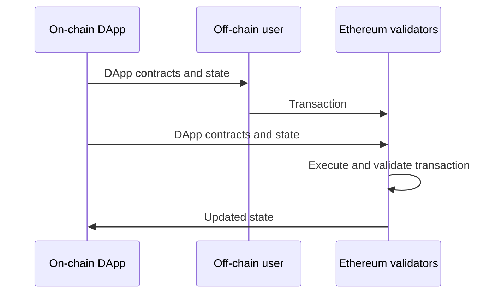
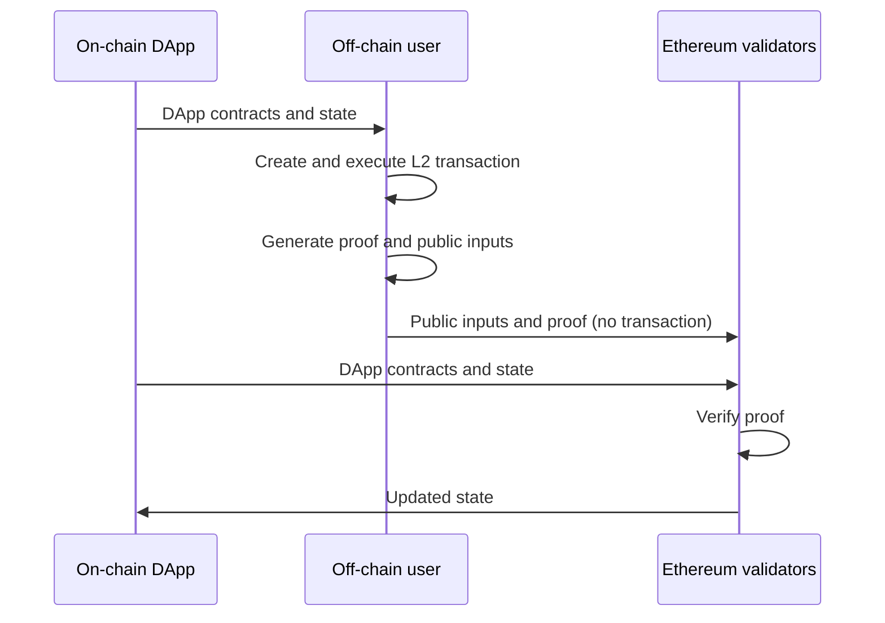

# Tokamak zk-EVM

Tokamak zk-EVM converts Tokamak Network Layer 2 transaction execution into
Tokamak zk-SNARK proof artifacts. Its proving protocol is described in the
[Tokamak zk-SNARK paper](https://eprint.iacr.org/2024/507).

Tokamak zk-EVM consists of:

- A QAP compiler that builds the supported Circom subcircuits into the circuit
  artifacts used for setup and proving.
- A Synthesizer that replays a Tokamak L2 transaction and creates the
  transaction-specific artifacts required for proving.
- A proving protocol that preprocesses circuit and public data, generates a
  proof of correct execution, and verifies that proof.

## Scope and compatibility

Tokamak Network Layer 2 (Tokamak L2) is the execution model proved by this
repository. A Tokamak L2 transaction has its own transaction shape and signing
flow, uses zero-knowledge-proof-friendly cryptographic primitives, and executes
against supplied state snapshots and block context. These are defined by
[TokamakL2JS](https://github.com/tokamak-network/TokamakL2JS), which supplies
the common transaction, state, cryptographic, and protocol-constant contract
for Tokamak zk-EVM. Tokamak zk-EVM is limited to a defined subset of EVM
contract functions: it generates circuit artifacts for those functions,
produces proofs that Tokamak L2 transactions executed them correctly, and
verifies the resulting proofs.

Tokamak zk-EVM therefore does not claim compatibility with arbitrary native
Ethereum L1 execution. Its transaction format, signing and cryptographic
primitives, state representation, and supplied execution context differ from
the native Ethereum environment. A function that runs in an Ethereum toolchain
is not automatically a supported Tokamak zk-EVM function. In addition, contract
creation, precompiles, transient storage, blob opcodes, invalid/self-destruct
paths, and other unvalidated execution combinations are outside the supported
boundary.

Within that environment, a supported contract function must meet two
conditions. First, every successful call in its intended domain must use only
supported execution features. Second, those calls must retain one fixed
execution trace and circuit layout: changing a permitted input or state value
must not change the executed instruction path, call or return flow, number and
order of memory or storage accesses, emitted logs, or circuit placements.

For example, a private-state transfer can process different note values when
each successful transfer follows the same path and accesses the same shaped
state. A function is outside the supported boundary if a permitted input selects
a different branch, changes a loop or call count, or changes the memory or
storage-access pattern. A successful proof for one transaction does not by
itself establish support for every input and state. Applications must validate
their intended domain using the
[Synthesizer transaction-support guide](./packages/frontend/synthesizer/README.md#transaction-support).

## Concrete application

Despite the limits on compatibility with native Ethereum execution, the
Synthesizer can reuse an EVM contract function already used by a native
Ethereum DApp, including one compiled from Solidity, when the call falls within
the supported boundary. It reads that function's EVM bytecode while replaying
the Tokamak L2 call and produces the transaction-specific circuit artifacts
used to prove the execution. This gives the DApp a path to reuse its contract
code in Tokamak L2 and, together with the proving backends, become a
privacy-preserving DApp.

### Abstract model of DApp execution on native Ethereum



### Abstract model of privacy-preserving DApp execution on Tokamak L2 using Tokamak zk-EVM



[Tokamak Private App Channels](https://github.com/tokamak-network/Tokamak-zk-EVM-contracts)
is a concrete integration of this flow. Its
[BridgeCore](https://etherscan.io/address/0xB1815dF9382449F48E2c26cAd75a07a51E3d72Fa#code)
is the on-chain coordinator: it records channel deployments, coordinates shared
custody, and creates a
[ChannelManager](https://etherscan.io/address/0x3108d92A38bFb4B3396DE7ad4D92318a8fbE61D7#code)
for a DApp in the [TPAC DApp registry](https://github.com/tokamak-network/Tokamak-zk-EVM-contracts#mainnet-registered-dapps),
using that DApp's registered metadata and verifier snapshot. Each channel is
associated with one registered DApp and maintains its own state commitment. In
the diagram, the Ethereum-validator lane is concretely a proof-submission
transaction to the ChannelManager. The ChannelManager checks the public inputs
against the DApp's fixed function metadata and current state commitment, then
calls the deployed
[TokamakVerifier](https://etherscan.io/address/0x9fDBDFDfD5CFbd38348FE709296E2E1063Bbd2Bd#code).
Ethereum validators execute this contract path; only an accepted proof updates
the channel's state commitment.

The private-state note-transfer DApp is one TPAC example. A user calls a
transfer function defined by the
[PrivateStateController](https://etherscan.io/address/0x67C6233A99D9f122Fef9DC111e89948107b34c2F#code),
which is deployed on Ethereum mainnet. The DApp's state records note commitments
and nullifiers for spent notes. To transfer value, the owner presents input
notes and specifies recipient notes. A direct call to the controller on native
Ethereum publishes its note and transfer data in transaction calldata. In
contrast, the Tokamak L2 path submits a proof and the required public inputs to
the ChannelManager instead of the raw transaction, so the input notes and their
ownership are not published on Ethereum.

This is an application-defined privacy boundary, not an automatic privacy layer
for a native Ethereum DApp. [Ethereum.org defines data availability](https://ethereum.org/developers/docs/data-availability/)
as “the confidence a user can have that the data required to verify a block is
really available to all network participants.” The DApp must therefore keep the
state data required for verification and continued use available. In the
private-state design, public state records note commitments and nullifiers while
privacy-sensitive note and transfer data remain in the original off-chain
transaction input. Tokamak zk-EVM leaves that disclosure design independent of
the proving system, so a DApp can express it in an Ethereum smart-contract
language such as Solidity.

## How the repository fits together

```text
Tokamak L2 snapshot
        │
        ▼
Synthesizer ──► transaction-specific artifacts
        │
        ├──► Native Rust backend ──► preprocess, proof, verification
        │
        └──► Browser backend ──────► preprocess, proof, verification
                 ▲
                 │
       Subcircuit library and compatible setup material
```

The [CLI](./packages/cli/README.md) is the supported end-to-end local entry
point and carries the TokamakL2JS transaction and state contract through that
workflow. Each package README provides its installation, commands, APIs, input
formats, examples, and operational responsibilities.

Native proving runs on CPU by default and can use ICICLE CUDA acceleration
when explicitly selected. The browser package supports bundler-based
preprocessing, proving, and verification. Package-specific compatibility and
verified environments are documented in the corresponding package README.

Unless you are embedding one component in another application, start with the
CLI. In the package descriptions below, R1CS means the circuit's rank-1
constraint system, a witness contains the values that satisfy those
constraints, and a CRS is the common reference string used by the proving
system.

## Choose a package

| Need                                            | Package                                     | Documentation and publication                                                                                                        |
| ----------------------------------------------- | ------------------------------------------- | ------------------------------------------------------------------------------------------------------------------------------------ |
| Complete local proof workflow                   | `@tokamak-zk-evm/cli`                       | [README](./packages/cli/README.md) · [npm](https://www.npmjs.com/package/@tokamak-zk-evm/cli)                                        |
| File-based synthesis in Node.js                 | `@tokamak-zk-evm/synthesizer-node`          | [README](./packages/frontend/synthesizer/node-cli/README.md) · [npm](https://www.npmjs.com/package/@tokamak-zk-evm/synthesizer-node) |
| Synthesis in a browser application              | `@tokamak-zk-evm/synthesizer-web`           | [README](./packages/frontend/synthesizer/web-app/README.md) · [npm](https://www.npmjs.com/package/@tokamak-zk-evm/synthesizer-web)   |
| Browser preprocessing, proving, or verification | `@tokamak-zk-evm/snark-browser-compat`      | [README](./packages/backend/wasm/README.md) · [npm](https://www.npmjs.com/package/@tokamak-zk-evm/snark-browser-compat)              |
| Prebuilt circuit artifacts                      | `@tokamak-zk-evm/subcircuit-library`        | [README](./packages/frontend/qap-compiler/README.md) · [npm](https://www.npmjs.com/package/@tokamak-zk-evm/subcircuit-library)       |
| Direct Rust backend development                 | Backend workspace; not separately published | [README](./packages/backend/README.md)                                                                                               |

## Releases and npm publication

Use mutually compatible versions of the supported packages. A version becomes
publicly available only when it appears on npm; the npm package pages above are
the source of truth for published versions and release tags.

The Rust backend is not published as a standalone npm package. The CLI ships
the compatible source and builds it locally. Consumer-facing release notes are
maintained in [CHANGELOG.md](./CHANGELOG.md).

## Technical evaluation

Tokamak zk-EVM is a specialized proving pipeline for the supported Tokamak L2
execution model, not a general Ethereum execution environment. Evaluate a
release against its published package versions, supported execution boundary,
and application-specific setup and deployment requirements.

- The [changelog](./CHANGELOG.md) records public protocol, compatibility, and
  measured performance changes.
- The [backend reports](./packages/backend/docs/optimization/) provide the
  underlying qualification and measurement evidence.

Setup and artifact provenance remain an application trust-boundary
responsibility.

## Learn more

- [Project overview on Medium](https://medium.com/tokamak-network/project-tokamak-zk-evm-67483656fd21) (updated January 2026)
- [Project slides](https://docs.google.com/presentation/d/1D49fRElwkZYbEvQXB_rp5DEy22HFsabnXyeMQdNgjRw/edit?usp=sharing)
- [Legacy Synthesizer GitBook](https://tokamak-network-zk-evm.gitbook.io/tokamak-network-zk-evm) (historical; package READMEs are current)
- [On-chain verifier and current deployment records](https://github.com/tokamak-network/Tokamak-zk-EVM-contracts)
- [LLM-readable repository map](./llms.txt)

## License

Tokamak zk-EVM is dual-licensed under
[MIT](./LICENSE-MIT) or [Apache-2.0](./LICENSE-APACHE), at your option.
Third-party dependencies and incorporated components retain their own
licenses.
