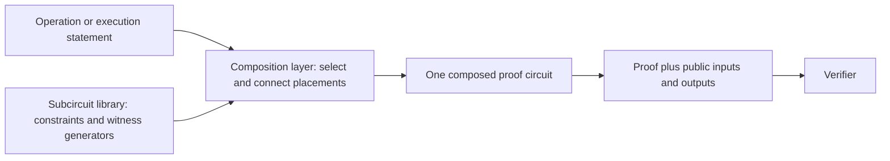

# Circuit Implementation and Composition Reference

## What this document explains

Tokamak zk-EVM proves that an Ethereum Virtual Machine (EVM) transaction was
executed correctly without asking the verifier to execute the transaction
again. The proof circuit is not written as one monolithic program. It is built
from smaller **subcircuits**, each of which handles a particular relation such
as addition, comparison, hashing, signature arithmetic, or movement across a
public input/output boundary.

This document explains every subcircuit built from the current qap-compiler
source. For each one, it answers five questions:

1. What operation does it perform?
2. How many constraints does it contain?
3. How many input and output wires does it expose?
4. Which wires are public and which remain private?
5. Is the subcircuit sufficient by itself, or does it rely on a particular
   composition with other subcircuits?

The intended audience is any reader who needs to understand the circuit
library, including application developers, auditors, integrators, and new
contributors. The detailed tables remain useful to circuit maintainers, but
no prior knowledge of this repository is assumed.

## Where the subcircuits fit

The qap-compiler directory contains Circom source and tools for producing the
prebuilt subcircuit library. The directory name is historical; users receive
the artifacts through the `@tokamak-zk-evm/subcircuit-library` package. A
separate **composition layer** selects the required subcircuits and records how
their wires must be connected. The proving system then uses those placements
and connections as one composed circuit. A verifier sees only the final proof
and the wires that the composed interface declares public.



This distinction matters for security. A compiled subcircuit is a reusable
module, not normally a complete proof statement. Some modules are deliberately
split to stay small. For example, EVM division is implemented by `ALU4A`
followed by `ALU4B`; neither half proves division by itself. The final
permutation must connect the exact outputs of the first half to the exact
inputs of the second half.

Most users should therefore consume the synchronized package through a
supported composition layer, CLI, or proving backend. They should not select
individual R1CS files and treat them as standalone proofs.

## Terms used in this document

| Term | Meaning here |
| --- | --- |
| EVM word | One 256-bit bit pattern used by the EVM. Signed opcodes interpret the same pattern using two's-complement notation. |
| Limb | Half of an EVM word. This library represents one 256-bit word as two 128-bit limbs. |
| Wire | One scalar-field value entering, leaving, or connecting circuit constraints. A 256-bit word therefore occupies two physical wires. |
| Constraint | An algebraic equation that a valid witness must satisfy. More constraints generally mean more proving work, but the count is not a security score. |
| R1CS | Rank-1 constraint system, the compiled algebraic form consumed by setup and proving. |
| Witness | The complete set of public and private wire values used to satisfy the circuit. |
| Public wire | A value bound to the final proof statement and available to the verifier. |
| Private wire | A witness value hidden from the verifier. Private does not mean unconstrained. |
| Placement | One use of a subcircuit in the circuit generated for a transaction. |
| Permutation | The final wire connections that make one placement's output equal another placement's input. |
| Canonical representation | The unique allowed limb encoding of an integer or field element. |
| Soundness | The property that satisfying the constraints is enough to establish the operation claimed by the circuit contract. |

### Logical types and physical wires

Non-buffer interfaces use a closed set of logical types. The interface JSON
files under `subcircuits/interface/` declare these types, and the build parser
derives the physical wire count rather than accepting a separately selectable
wire layout:

| Logical type | Meaning | Physical representation |
| --- | --- | --- |
| `uint(bits)` for `1 <= bits <= 160` | An unsigned integer in the declared range | One field wire |
| `uint(bits)` for `161 <= bits <= 256` | An unsigned integer in the declared range | Two lower-first limb wires: 128 low bits, then `bits - 128` high bits |
| `bls12-381-fr` | One native BLS12-381 scalar-field element | One field wire |
| `jubjub-scalar` | One integer in the Jubjub scalar domain | One field wire |

Buffers are deliberately different. They are generic arrays of field wires
and have no per-entry interface JSON. A buffer may carry native field values,
one-wire flags or narrow integers, and limb pairs in the same physical array.
The connected producer, consumer, and public-boundary protocol retain the
logical meaning of each wire; the buffer itself proves only equality.

The generated witness wrapper uses the logical interface metadata to warn when
an original input is outside its declared domain. A warning is diagnostic only:
it is not a circuit constraint, does not make an invalid witness valid, and
must not be treated as a security check. Soundness comes from circuit
constraints and the explicitly documented composition and verifier contracts.

## How to interpret the soundness status

The status describes the current source-level relation under the composition
model used by Tokamak zk-EVM:

- **Locally sound** means the subcircuit itself enforces the listed operation
  for its declared input representation. It still needs normal wire routing,
  but it has no mandatory partner circuit.
- **Composition-dependent** means the system claim is sound only when the
  composition layer and final permutation enforce the exact producer, consumer,
  ordering, or public-boundary contract stated in this document.
- **Incomplete** means known constraint work remains in the current source.
  The normal composition topology alone is not enough to claim soundness for
  that operation.

An `Incomplete` row is a warning about the repository state described by this
page, not a conclusion about every previously published npm release. A release
must be evaluated using the source, generated artifacts, and setup material
from that same version. Never mix artifacts from different versions.

This page is an engineering reference, not a formal proof or third-party
security certification. It reports composition dependencies explicitly so
that a property enforced by another subcircuit or by the verifier boundary is
not mistakenly attributed to an isolated artifact.

## Three representative examples

### A self-contained arithmetic operation

For `ADD`, the composition layer places `ALU1` with the `ADD` selector and two EVM
words. `ALU1` checks the limb ranges, constrains the addition, and returns one
canonical EVM word. No second arithmetic subcircuit is required, so the row is
marked locally sound.

### An operation split across two subcircuits

For `DIV`, the composition layer must place `ALU4A` and `ALU4B` in that order.
`ALU4A` prepares the quotient, remainder, magnitude, and mode information;
`ALU4B` checks the remaining division relation and produces the EVM result.
The pair is sound only if all 13 intermediate wires are connected exactly, so
both rows are marked composition-dependent.

### A public boundary

`bufferTxIn` copies public transaction-input wires to private internal wires.
The verifier can see the public side, while later computation uses the private
side. `bufferPrvIn` is different: both sides remain private because it carries
private witness data. Buffer constraints prove equality across the boundary;
the surrounding protocol assigns meaning to the values.

## How the rest of this page is organized

- **Buffer subcircuits** lists the modules that cross the final public/private
  boundary and explains the type and capacity of each buffer.
- **Computational subcircuits** lists arithmetic, comparison, hashing,
  signature, conversion, and equality modules.
- **Mandatory and conditional composition contracts** expands every table row
  whose security or full operation semantics depend on another placement or
  on a restricted producer.
- **Update checklist** tells maintainers which synchronized artifacts and
  contracts must be reconsidered when the implementation changes.

## Scope and source snapshot

The tables cover every production target in
[`scripts/compile.sh`](../scripts/compile.sh). Files under
`subcircuits/circom/unused/` are historical or experimental and are not
included. The values describe the current source tree, not necessarily the
contents of an older installed package or the checked-in generated library.

The production list currently contains 32 compiled subcircuit types: seven
generic buffers, 19 general computational or support types, and six
transaction-signature component types. This is a physical library catalog,
not a count of EVM operations or transaction placements. A logical operation
may select one type, compose several different types, or place the same type
multiple times.

The integrated O2 build has the following catalog totals. These values sum
each distinct compiled type exactly once; they are not a transaction's dynamic
placement count or its placement-weighted proving cost. “Internal wires”
excludes each wrapper's constant-one wire and declared input/output ports.

| Catalog subset | Types | Constraints | R1CS wires | Internal wires | Input ports | Output ports | Nonzero coefficients |
| --- | ---: | ---: | ---: | ---: | ---: | ---: | ---: |
| Entire production catalog | 32 | 20,720 | 20,922 | 18,415 | 1,081 | 1,394 | 126,398 |
| Generic buffers | 7 | 1,520 | 1,527 | 0 | 760 | 760 | 4,560 |
| Computational and support types | 25 | 19,200 | 19,395 | 18,415 | 321 | 634 | 121,838 |
| Transaction-signature types only | 6 | 5,097 | 5,276 | 4,788 | 186 | 296 | 34,848 |

A hypothetical “one placement of every type” would contain 32 placements, but
it is not an operation supported by the system. Actual placement multiplicity
is defined by the composition contracts below. For example, most ALU opcodes
use one placement, division uses the `ALU4A -> ALU4B` pair, and transaction
signature verification uses 16 placements of six distinct types.

> **Implementation and release status**
>
> The qap source catalog and qap-local direct-composition tests described here
> are implemented. The revised transaction-signature composition is not yet
> enabled by the Synthesizer. The qap memory-load step is also implemented, but
> the Synthesizer still uses the obsolete generated `Accumulator` artifacts
> until its separately reviewed memory-load composition migration is complete.
> Compatibility replay against the released
> TokamakL2JS implementation of issue #2 and the delegated Solidity public
> checks are still pending. Checked-in generated circuit artifacts and the CRS
> have not been updated for this source catalog. This page therefore describes
> source implementation and required integration contracts; it is not a
> statement that the complete system is ready to publish or deploy.

Constraint counts were measured from the current source with Circom 2.2.3,
explicit O2 optimization, the BLS12-381 scalar field, and the
production target list in `scripts/compile.sh`. A total is the sum of the
reported nonlinear and linear constraints. Re-run the production compile
before relying on these numbers after any source or constant change.

O2 may eliminate a private signal that is used only through linear relations.
Every compiled subcircuit wrapper therefore exposes its intended physical
inputs as temporary public inputs to Circom. The final composition layer still
assigns actual proof visibility; this standalone compiler annotation exists
only to preserve every reviewed subcircuit interface wire during O2.

Wire counts are physical scalar-field wires. Interface counts do not include
the local constant-one wire. Every 256-bit word uses this order:

1. lower 128-bit limb
2. upper 128-bit limb

Visibility refers to the final composed proof interface constructed by
[`scripts/parse.js`](../scripts/parse.js) and
[`scripts/configure.js`](../scripts/configure.js), not to the temporary
standalone visibility used while Circom compiles one wrapper. All non-buffer
interfaces are private internal wires. The public side of each buffer is
selected explicitly by `PUBLIC_WIRE_SEGMENTS`.

Physical non-buffer privacy must not be confused with semantic disclosure.
For transaction-signature verification, `contract`, `selector`, `S`, and the
identity point `O` are bound through public buffers even though their wires are
routed privately after crossing that boundary. `A`, `R`, private transaction
inputs, the challenge hash, the public-key hash, and all signature accumulator
state remain hidden. A composition is valid only if it connects these exact
boundary-supplied wires; substituting an equal-looking host value is not an
equivalent security contract.

## Buffer subcircuits

Every buffer is a `Buffer2` equality boundary: it constrains each output wire
to equal the corresponding input wire and adds a nonlinear constraint to keep
both columns represented in the R1CS. That copy relation is locally sound.
The semantic type, capacity, padding interpretation, and public-format checks
are composition or higher-protocol responsibilities.

A buffer capacity is the number of physical input wires accepted by its
`Buffer2` instance. The buffer exposes the same number of output wires, but
those outputs are not added to the capacity. Buffers do not impose one common
logical value type: a native field value or one-limb value occupies one input
wire, while a 256-bit EVM word occupies two 128-bit-limb input wires. Mixed
values therefore consume capacity according to their actual physical wire
layouts after expansion by the composition layer.

| Subcircuit | Role and current capacity | Constraints (nonlinear + linear = total) | Final interface visibility | Soundness contract |
| --- | --- | ---: | --- | --- |
| `bufferLogOut` | Committed EVM log output; 50 input wires | 50 + 50 = 100 | 50 private inputs -> 50 public outputs | Local equality; the higher protocol interprets tuple layout and all-zero padding. |
| `bufferStorageStore` | Final storage writes; 30 input wires | 30 + 30 = 60 | 30 private inputs -> 30 public outputs | Local equality; triples must be routed as address, key, value. |
| `bufferStorageLoad` | Initial storage reads; 40 input wires | 40 + 40 = 80 | 40 private inputs -> 40 public outputs | Local equality; triples must be routed as address, key, value. |
| `bufferTxIn` | Transaction inputs; 6 input wires | 6 + 6 = 12 | 6 public inputs -> 6 private outputs | Local equality plus public-boundary format checking. |
| `bufferBlockIn` | Block fields and previous block hashes; 24 input wires | 24 + 24 = 48 | 24 public inputs -> 24 private outputs | Local equality plus public-boundary format checking. |
| `bufferEVMIn` | Fixed EVM inputs and constants; 530 input wires | 530 + 530 = 1,060 | 530 public inputs -> 530 private outputs | Local equality plus public-boundary format checking. |
| `bufferPrvIn` | Private witness inputs; 80 input wires | 80 + 80 = 160 | 80 private inputs -> 80 private outputs | Local equality; it is intentionally absent from `PUBLIC_WIRE_SEGMENTS`. |

Public-output buffers are fixed-capacity and zero-padded. The higher-level
protocol filters storage entries with a zero address and log entries whose
fields are all zero. The buffer circuits do not perform those semantic checks.

## Computational subcircuits

In the interface descriptions below, `word` means two physical 128-bit limb
wires and `bit` means one scalar-field wire constrained to be boolean where the
stated local relation requires it. All interfaces in this table are private
inside the final composed proof; the verifier does not receive each arithmetic
input and intermediate result as a separate public value.

| Subcircuit | Operation or role | Constraints (nonlinear + linear = total) | Private interface | Status |
| --- | --- | ---: | --- | --- |
| `ALU1` | `ADD`, `MUL`, `SUB`, and `NOT` | 922 + 0 = 922 | 5 inputs: selector, two words; 2 outputs: one word | Locally sound. Both words are canonical, multiplication is truncated to the EVM word width, the selected output is canonical, and the selector polynomial admits exactly the four supported operations. Unary `NOT` still receives and constrains the unused second word. |
| `ALU2` | `LT`, `GT`, `SLT`, `SGT`, `EQ`, and `ISZERO` | 793 + 1 = 794 | 5 inputs: selector, two words; 2 outputs: one word | Locally sound. Both words are canonical, signed and unsigned comparisons share the same constrained ordering data, equality is reused by `EQ`, `ISZERO` is checked locally, and the selector is restricted to the six supported values. |
| `ALU3` | `SIGNEXTEND`, `AND`, `OR`, `XOR`, and `BYTE` | 944 + 0 = 944 | 5 inputs: selector, index-or-left word, value-or-right word; 2 outputs: one word | Locally sound. All four operand limbs are decomposed once; index operations share the constrained index and value bits, bitwise operations share one product per operand bit, and the selector is restricted to the five supported values. |
| `ALU4A` | First half of `DIV`, `MOD`, `SDIV`, `SMOD` | 672 + 0 = 672 | 5 inputs: selector, dividend word, divisor word; 13 outputs | Composition-dependent; never use as an independent EVM operation. It constrains the selector to exactly the four supported operations and must be followed by `ALU4B` with all 13 outputs connected exactly. |
| `ALU4B` | Second half of `DIV`, `MOD`, `SDIV`, `SMOD` | 802 + 0 = 802 | 13 inputs; 2 outputs: one word | Composition-dependent; never use independently. Its inputs must be the exact `ALU4A` outputs from the same operation. |
| `SHL` | Full-domain EVM logical left shift | 795 + 0 = 795 | 4 inputs: shift word, value word; 2 outputs: one word | Composition-dependent for exact limb representation. The low shift limb and both value limbs are canonical locally; the high shift limb is checked only for zero because every nonzero value yields the same zero result. Its producer must constrain that wire as a canonical 128-bit limb. |
| `ALU5` | Full-domain EVM `SHR`, `SAR` | 816 + 0 = 816 | 5 inputs: selector, shift word, value word; 2 outputs: one word | Composition-dependent for exact limb representation. The low shift limb and both value limbs are canonical locally; the high shift limb is checked only for zero because all nonzero values select the same oversized-shift result. Its producer must constrain that wire as a canonical 128-bit limb. `SHR` and `SAR` share the shift core, and `SAR` constrains sign fill locally. |
| `ADDMODPrepare` | Canonicalizes the addends and prepares the exact 257-bit numerator and bounded reduction candidates | 943 + 1 = 944 | 6 inputs: three words; 8 outputs: three numerator words, three quotient words, and one remainder word | Composition-dependent. It decomposes both addends into field-safe radix-86 words, proves their exact sum, bounds the complete quotient candidate, and emits the remainder candidate. The remainder becomes constrained only in `ADDMODVerify`. |
| `ADDMODVerify` | Canonicalizes the modulus and remainder, verifies the 257-by-256 reduction, and returns the EVM result | 957 + 2 = 959 | 10 inputs: eight preparation wires plus the original modulus word; 2 outputs: one word | Composition-dependent. It must receive the exact `ADDMODPrepare` outputs and the exact original modulus operand. It proves `numerator = quotient * safeModulus + remainder` in radix 86, enforces `remainder < safeModulus`, and returns zero for an original zero modulus. |
| `MULMODPrepare` | Canonicalizes the three EVM operands and generates the full-width quotient and remainder candidates | 768 + 6 = 774 | 6 inputs: three words; 18 outputs: twelve 64-bit operand words, four quotient limbs, and two remainder limbs | Composition-dependent; never use independently. The operand words are canonical, but the quotient and remainder outputs are witness candidates whose validity is established only by the following two stages. |
| `MULMODCandidate` | Canonicalizes the quotient and remainder candidates for the full-width reduction relation | 768 + 6 = 774 | 6 inputs: four quotient limbs and two remainder limbs; 12 outputs: eight quotient words and four remainder words | Composition-dependent; never use independently. Its six inputs must be the exact candidate outputs of `MULMODPrepare`, without host reconstruction or substitution. |
| `MULMODVerify` | Proves the complete 512-bit multiplication and modular-reduction relation and returns the EVM result | 981 + 2 = 983 | 24 inputs: twelve operand words, eight quotient words, and four remainder words; 2 outputs: one word | Composition-dependent; never use independently. It proves `lhs * rhs = quotient * safeModulus + remainder`, enforces `remainder < safeModulus`, and uses a safe modulus of one so zero modulus returns zero. |
| `DecToBit` | Decomposes one canonical 256-bit word into 256 LSB-first bits | 256 + 2 = 258 | 2 inputs: one word; 256 bit outputs | Locally sound. It supplies exponent or scalar bits to composed exponentiation chains. |
| `SubExp` | One LSB-first square-and-multiply step for EVM `EXP` | 794 + 0 = 794 | 5 inputs: accumulator word, base-power word, and one bit; 4 outputs: next accumulator and base-power words | Composition-dependent; never use independently. It canonicalizes both input words and constrains the conditional factor, truncated square, and truncated accumulator product modulo `2^256`. Its bit must be the exact corresponding output of `DecToBit`. Both output words must feed the exact next `SubExp`; after the last step, the accumulator must feed `CheckBus256`. The unused final base-power word is discarded. |
| `CheckBus256` | Canonicalizes and passes through one 256-bit word | 256 + 2 = 258 | 2 inputs: one word; 2 outputs: the exact checked word | Locally sound. In the EVM `EXP` composition it is the mandatory terminal consumer of the final `SubExp` accumulator and supplies the operation result. |
| `MemoryViewStep` | Applies one byte-aligned fragment to a running 256-bit memory view and its packed byte-ownership state | 614 + 1 = 615 | 7 inputs: source word, encoded byte shift, incoming ownership, previous word, and previous ownership; 3 outputs: next word and ownership | Composition-dependent; never use independently. Source limbs, the six-bit encoded shift, ownership masks, byte shifting, masking, and disjointness are constrained locally. The first placement must receive an exact zero state, and every later placement must receive the previous placement's exact three outputs. |
| `Poseidon` | Selector-chosen chain of up to four two-input Poseidon compressions over `uint(256)` words; current batch size is 4 | 964 + 0 = 964 | 11 inputs: selector and five lower-first `uint(256)` words; 2 outputs: one lower-first `uint(256)` word | Composition-dependent for exact limb representation. The local hash relation is `PoseidonFr(x mod Fr)` for each input word and intentionally does not require `x < Fr`; connected producers or the public-boundary verifier must constrain each physical limb to its declared width. |
| `FrToLimbsPair` | Converts two independent native BLS12-381 scalar-field values to lower-first two-limb EVM words | 1,022 + 2 = 1,024 | 2 native-field inputs; 4 outputs: two lower-first limb pairs | Locally sound as two canonical conversions. Each input is constrained to its unique integer representation `0 ≤ x < Fr`; the circuit is general-purpose and is not part of the TSV placement catalog. |
| `TransactionSignaturePoseidonBatch4` | Performs either four consecutive native-field Poseidon compressions or one independent compression plus a three-compression chain | 950 + 0 = 950 | 7 inputs: mode and six native field wires; 2 native-field outputs | Composition-dependent. Mode is locally Boolean, but the composition must assign the approved structural mode and connect every chain state exactly. |
| `TransactionSignaturePointPolicy` | Checks contract width, validates `A` and `R`, applies the public-key cofactor policy, rejects an identity randomizer, builds the variable-base table, and computes `R8` | 223 + 6 = 229 | 8 inputs; 17 outputs: one native `uint160` contract wire, two selector limbs, two lower-first contract-word limbs, 8 table coordinates, and 4 `R8` coordinates | Composition-dependent. Solidity must bind selector width and the identity point; later signature placements must consume the exact table and `R8` outputs. The contract word and native contract output are both derived from the same constrained 160-bit input. |
| `TransactionSignatureFixedPrefix70` | Canonically decomposes `S` into 252 bits and processes fixed-base windows 0–69 | 1,016 + 0 = 1,016 | 1 native scalar input; 46 outputs: 42 remaining bits and 4 accumulator coordinates | Composition-dependent. Solidity must bind `S < n`, and `TransactionSignatureFinal` must consume its exact remaining bits and accumulator. |
| `TransactionSignatureChallengeVariablePrefix` | Canonically decomposes the native challenge hash and processes variable-base windows 127–111 | 982 + 0 = 982 | 9 inputs: challenge plus 8 table coordinates; 226 outputs: 222 remaining bits and 4 accumulator coordinates | Composition-dependent. It must consume the exact final challenge hash and exact point-policy table; the table's first point must be the verifier-bound identity `(0, 1)`, and all later variable placements must consume its exact bits and accumulator. |
| `TransactionSignatureVariableBatch` | Processes 34 two-bit variable-base windows while retaining the extended accumulator | 986 + 0 = 986 | 80 inputs; 4 extended-coordinate outputs | Composition-dependent. Exactly three serial placements consume disjoint descending challenge-bit ranges and the same exact runtime-table wires. |
| `TransactionSignatureFinal` | Processes fixed-base windows 70–83 and variable-base windows 8–0, enforces the cofactored signature equation, canonically decomposes the public-key hash, and returns the origin as a two-limb `uint256` EVM word | 935 + 0 = 935 | 81 inputs; 2 outputs: origin limbs | Composition-dependent. It must receive the exact remaining response and challenge bits, both accumulator chains, runtime table, `R8`, and native public-key hash from the preceding placements. The circuit's origin relation remains narrower than the consumer type (`origin < 2^160`). |
| `StorageAccess` | Binds a repeated storage address/key pair to its canonical cached identity | 6 + 0 = 6 | Current 160-bit address, current 256-bit key, canonical 160-bit address, and canonical 256-bit key; no outputs | Locally sound as address and key equality. Storage consistency additionally depends on the composition layer routing the current and cached values to the corresponding positions. |

## Mandatory and conditional composition contracts

### Division family: `ALU4A -> ALU4B`

Every `DIV`, `MOD`, `SDIV`, and `SMOD` operation uses exactly two adjacent
placements in this order. `ALU4A` consumes the operation selector and original
operands. Its 13 physical outputs must be connected to the 13 `ALU4B` inputs
without substitution or reordering:

1. `absDividend[2]`
2. `absQuotient[2]`
3. `absRemainder[2]`
4. `absDivisorWords[4]`
5. `divisorIsZero`
6. `resultIsNegative`
7. `useMod`

Only the two-limb output of `ALU4B` is the EVM result. Neither half represents
a sound or independently usable EVM division operation.

### Modular family

Every logical `ADDMOD` uses exactly two placements:

```text
ADDMODPrepare -> ADDMODVerify
```

All eight physical preparation outputs must feed their declared
`ADDMODVerify` inputs without host reconstruction, substitution, or
reordering. The exact original modulus operand supplied to `ADDMODPrepare`
must also feed the two dedicated modulus inputs of `ADDMODVerify`. Only the
final two `ADDMODVerify` outputs form the EVM result. The two targets contain
944 and 959 constraints respectively, for a one-per-type sum of 1,903; each
target remains below the 1,024-constraint limit. Neither target is an
independently usable EVM operation.

Circom inspection intentionally reports the `ADDMODPrepare` modulus and
remainder-candidate hint path as locally unconstrained. The modulus is needed
there to generate the quotient and remainder witness candidates, while
`ADDMODVerify` owns the actual reduction claim. This is acceptable only when
the exact original modulus and all exact preparation outputs are connected to
the verifier stage as specified above. The preparation target alone makes no
modular-reduction claim.

Every logical `MULMOD` uses exactly three placements:

```text
MULMODPrepare -> MULMODCandidate -> MULMODVerify
```

The operation has no selector input and no preceding `CheckBus256` placement.
`MULMODPrepare` locally canonicalizes all three input words. Its six physical
quotient and remainder candidate wires must feed `MULMODCandidate` exactly.
The twelve canonical operand-word outputs of `MULMODPrepare`, followed by all
twelve outputs of `MULMODCandidate`, must feed `MULMODVerify` in their declared
order. This produces 30 exact producer-consumer wire connections across the
composition. Host reconstruction, substitution, reordering, omission, or
independent use of any stage violates the soundness contract. Only the final
two `MULMODVerify` outputs form the EVM result. The three targets contain 774,
774, and 983 constraints respectively, for a one-per-type sum of 2,531; each
target remains below the 1,024-constraint limit.

Circom inspection intentionally reports the quotient and remainder candidate
signals in `MULMODPrepare` as locally unconstrained. They are witness-generation
hints, not claims proved by that stage. This warning is acceptable only because
the mandatory composition connects those exact wires to `MULMODCandidate` and
then to `MULMODVerify`, which proves their canonical bounds and complete
arithmetic relation. Treating `MULMODPrepare` as a standalone circuit would be
unsound.

The arithmetic relations preserve the full 257-bit addition numerator or
512-bit multiplication numerator. Reduction uses a safe modulus of one for an
EVM zero modulus, proves the complete quotient-product-plus-remainder identity,
and constrains the remainder below the safe modulus. Both operations therefore
return zero for a zero modulus without truncating the numerator.

### EVM exponentiation: `DecToBit -> SubExp* -> CheckBus256`

EVM `EXP(base, exponent)` uses one `DecToBit` placement on the exponent,
followed by exactly 256 serial `SubExp` placements and one terminal
`CheckBus256` placement. The first step receives accumulator `1`, base-power
`base`, and exponent bit 0. Each later step consumes all four exact state
outputs of its predecessor and the next LSB-first exponent bit. The terminal
checker consumes the exact final accumulator and returns the EVM result; the
final base-power output is discarded because no later statement uses it.

This topology is part of the soundness contract. Every bit input must be the
corresponding Boolean output of the same `DecToBit` placement, every four-wire
state transition must be connected without substitution or reconstruction,
and the terminal accumulator must pass through `CheckBus256`. A standalone
`SubExp` does not locally canonicalize its outputs and is therefore not an
independently usable exponentiation statement.

The three target types contain 258, 794, and 258 constraints respectively, so
every physical target remains below the 1,024-constraint limit. A full EVM
`EXP` uses 258 placements and 203,780 placement-weighted constraints. The
distinct-type constraint sum for this composition is 1,310.

### Poseidon chain expansion

One `Poseidon` placement supports up to `nPoseidonBatch()` consecutive
two-input compressions. The current batch size is 4, so selectors `1`, `2`,
`4`, and `8` select one through four compressions, respectively. A placement
always receives five padded `uint(256)` words: the first chain value followed
by four possible right-hand inputs. For a longer input list, the composition
layer repeats this normalized placement and connects each previous hash output
as the first input of the next placement. This repetition and every selector
are structurally determined by the input count, not by witness values.

The repeated topology is required for the higher-arity hash operation. Unique
`uint(256)` limb representation remains a separate producer or public-boundary
contract. The operation deliberately maps each reconstructed input integer to
the circuit field before hashing: inputs that differ by a multiple of `Fr`
represent the same Poseidon field input. It does not hash the two limbs as two
independent Poseidon inputs and it does not reject an input merely because the
reconstructed 256-bit integer is greater than or equal to `Fr`.

### Transaction-signature composition

Transaction signature verification is one operation implemented by six
compiled subcircuit types and 16 placements. The types are not six independent
signature schemes. Their exact ordered composition is the security boundary:

1. Eight chain-mode `TransactionSignaturePoseidonBatch4` placements compute
   challenge hashes 0–31. One independent-mode placement computes the public-key
   hash and challenge hashes 32–34. This accounts for all 35 challenge
   compressions and the one public-key compression without using the general
   split-limb EVM `Poseidon` circuit.
2. One `TransactionSignaturePointPolicy` placement owns point validity,
   public-key cofactor policy, randomizer identity rejection, the 160-bit
   contract check, selector limb projection, the runtime variable-base table,
   and `R8`.
3. One `TransactionSignatureFixedPrefix70` placement canonically decomposes
   `S`, consumes response bits 0–209 in fixed-base windows 0–69, and exposes
   only response bits 210–251 plus its four-coordinate accumulator.
4. One `TransactionSignatureChallengeVariablePrefix` placement canonically
   decomposes the exact final challenge hash, consumes challenge bits 222–254
   in variable-base windows 127–111, and exposes only challenge bits 0–221 plus
   its four-coordinate accumulator.
5. Three serial `TransactionSignatureVariableBatch` placements consume
   challenge-bit ranges 154–221, 86–153, and 18–85, respectively. Every
   placement receives the same eight runtime-table wires and the exact previous
   four-wire accumulator.
6. One `TransactionSignatureFinal` placement consumes response bits 210–251,
   challenge bits 0–17, both final accumulator chains, the exact runtime table,
   exact four-wire `R8`, and exact native public-key hash. It processes the
   remaining 14 fixed windows and 9 variable windows, enforces the cofactored
   equation, canonically decomposes the hash internally, and exposes only the
   lower-first two-limb origin result.

For 29 private transaction inputs, the six distinct types contain 5,097 O2
constraints and 5,276 R1CS wires in total. The 16 placements contain 14,669
constraints before final cross-placement permutation. Their declared
interfaces contain 402 physical placement input wires and 320 physical
placement output wires.
A diagnostic direct composition compiles to 14,646 nonlinear plus 3 linear
constraints, 14,677 wires, and 134,924 nonzero matrix entries. The direct
composition and the monolithic reference accept and reject the same complete
21-vector regression corpus and produce the same contract, selector, and
origin outputs for every accepted vector.

The circuit owns contract width, point validity, public-key cofactor policy,
randomizer identity rejection, canonical challenge and public-key-hash views,
scalar arithmetic, the cofactored terminal equation, and origin derivation.
Transaction inputs remain native field wires during signature verification.
When later EVM execution needs 256-bit words, the composition layer must place
general `FrToLimbsPair` conversions on those exact authenticated input wires
and must route only the conversion outputs into the EVM path; those conversions
are deliberately outside the 16 signature placements. The Solidity verifier
must bind the exact public wires and enforce
`S < n`, `selector < 2^32`, and `O = (0, 1)`. These delegated checks are part of
the complete statement and cannot be omitted. All native field operands and
all intermediate accumulator coordinates remain private internal wires. The
five public semantic inputs are the one-wire contract, selector, and `S`
values plus the two coordinates of `O`; the remaining 34 direct-composition
inputs are private. The six direct-composition outputs are the two-limb
contract, two-limb selector, and two-limb origin views. These diagnostic
composition counts describe qap-local testing, not the final public indices of
an enabled Synthesizer build.

### Memory-view composition

A memory-view reconstruction places one `MemoryViewStep` for every source
fragment. The first placement receives the exact state `[wordLow = 0,
wordHigh = 0, ownership = 0]`. Each later placement receives the preceding
placement's two word limbs and packed ownership output without substitution or
reordering. The final two word outputs form the reconstructed EVM word; the
ownership output is composition state and is not an EVM result.

Each placement receives the original, unshifted source word; a six-bit encoded
shift whose low five bits are the byte-shift magnitude and whose high bit is the
direction (`0` left, `1` right); and one packed ownership bit for every target
byte supplied by that fragment. One `Num2Bits(6)` decomposition supplies both
shift controls directly. The circuit decomposes the source and ownership values,
performs one five-stage byte barrel shift, masks unowned bytes, rejects ownership
overlap, and adds only disjoint byte positions to the running word. Consequently
the serial composition needs neither an addition carry witness nor a terminal
word range-check placement.

Every placement returns the real ownership union. The composition layer must
bind all three state wires exactly and selects the last placement's word as the
reconstructed result. Any unowned byte remains zero by induction from the exact
zero initial state and the rule that a step writes only bytes it owns. There is
no separate expected-coverage input: it was derived from the fragment ownership
masks and provided no independent circuit information after terminal gap closure
was removed.

The composition layer must convert each selected memory byte from its existing
`FF`/`00` value mask to the same-position ownership bit and reject malformed
mask bytes and non-byte-aligned shifts. It must not add a synthetic zero-valued
fragment for uninitialized gaps. A completely uninitialized view may
use the exact static-zero route without placing this target. These producer,
ownership, and state-wiring conditions are mandatory soundness dependencies
and require Synthesizer permutation tests before the source catalog can be
enabled.

### Public boundary contract

A complete system and every releasable artifact set must validate the format
of every public buffer input and output in the verifier wrapper. Non-buffer
inputs and outputs remain private internal wires connected by the final
permutation. The current source catalog alone does not prove that a deployed
wrapper already satisfies this requirement. If a future composition exposes a
native field or Jubjub value through a public buffer, that boundary must enforce
the value's declared domain rather than relying only on field normalization.
For the general `Poseidon` adapter, the boundary instead enforces the declared
`uint(256)` limb widths; `x < Fr` is intentionally not part of that operation.

## Update checklist

When a subcircuit, capacity constant, or composition changes:

1. Update the production target list and every consumer-side target registry together.
2. Add or update the non-buffer interface JSON and verify that each declared
   logical port expands to the compiled physical input and output wire counts.
3. Recompile every production target and update constraint and wire counts in
   this document.
4. Re-evaluate local soundness and every mandatory producer/consumer contract.
5. Update consumer-side composition definitions and exact-wire permutation tests.
6. Re-evaluate public/private boundaries in `scripts/configure.js` and
   `scripts/parse.js`.
7. Verify that every supported closed logical type still has one unambiguous
   physical expansion and that generic buffers have not acquired an implicit
   value type.
8. Verify witness diagnostics cover every declared input port, while keeping
   warnings explicitly non-authoritative for proof soundness.
9. Regenerate published circuit artifacts and any setup material only after
   the topology and soundness review is approved.
