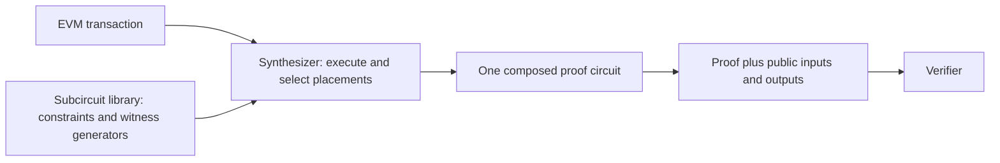

# Circuit Implementation and Composition Reference

## What this document explains

Tokamak zk-EVM proves that an Ethereum Virtual Machine (EVM) transaction was
executed correctly without asking the verifier to execute the transaction
again. The proof circuit is not written as one monolithic program. It is built
from smaller **subcircuits**, each of which handles a particular relation such
as addition, comparison, hashing, signature arithmetic, or movement across a
public input/output boundary.

This document explains every subcircuit built from the current qap-compiler
source. For each one, it answers five questions:

1. What operation does it perform?
2. How many constraints does it contain?
3. How many input and output wires does it expose?
4. Which wires are public and which remain private?
5. Is the subcircuit sufficient by itself, or does it rely on a particular
   composition created by the Synthesizer?

The intended audience is any reader who needs to understand the circuit
library, including application developers, auditors, integrators, and new
contributors. The detailed tables remain useful to circuit maintainers, but
no prior knowledge of this repository is assumed.

## Where the subcircuits fit

The qap-compiler directory contains Circom source and tools for producing the
prebuilt subcircuit library. The directory name is historical; users receive
the artifacts through the `@tokamak-zk-evm/subcircuit-library` package. The
**Synthesizer** executes a supported EVM transaction, selects the required
subcircuits, and records how their wires must be connected. The proving system
then uses those placements and connections as one composed circuit. A verifier
sees only the final proof and the wires that the composed interface declares
public.

This distinction matters for security. A compiled subcircuit is a reusable
module, not normally a complete proof statement. Some modules are deliberately
split to stay small. For example, EVM division is implemented by `ALU4A`
followed by `ALU4B`; neither half proves division by itself. The final
permutation must connect the exact outputs of the first half to the exact
inputs of the second half.

Most users should therefore consume the synchronized package through the
Synthesizer, CLI, or proving backend. They should not select individual R1CS
files and treat them as standalone proofs.

## Terms used in this document

| Term | Meaning here |
| --- | --- |
| EVM word | One 256-bit bit pattern used by the EVM. Signed opcodes interpret the same pattern using two's-complement notation. |
| Limb | Half of an EVM word. This library represents one 256-bit word as two 128-bit limbs. |
| Wire | One scalar-field value entering, leaving, or connecting circuit constraints. A 256-bit word therefore occupies two physical wires. |
| Constraint | An algebraic equation that a valid witness must satisfy. More constraints generally mean more proving work, but the count is not a security score. |
| R1CS | Rank-1 constraint system, the compiled algebraic form consumed by setup and proving. |
| Witness | The complete set of public and private wire values used to satisfy the circuit. |
| Public wire | A value bound to the final proof statement and available to the verifier. |
| Private wire | A witness value hidden from the verifier. Private does not mean unconstrained. |
| Placement | One use of a subcircuit in the circuit generated for a transaction. |
| Permutation | The final wire connections that make one placement's output equal another placement's input. |
| Canonical representation | The unique allowed limb encoding of an integer or field element. |
| Soundness | The property that satisfying the constraints is enough to establish the operation claimed by the circuit contract. |

## How to interpret the soundness status

The status describes the current source-level relation under the composition
model used by Tokamak zk-EVM:

- **Locally sound** means the subcircuit itself enforces the listed operation
  for its declared input representation. It still needs normal wire routing,
  but it has no mandatory partner circuit.
- **Composition-dependent** means the system claim is sound only when the
  Synthesizer and final permutation enforce the exact producer, consumer,
  ordering, or public-boundary contract stated in this document.
- **Incomplete** means known constraint work remains in the current source.
  The normal composition topology alone is not enough to claim soundness for
  that operation.

An `Incomplete` row is a warning about the repository state described by this
page, not a conclusion about every previously published npm release. A release
must be evaluated using the source, generated artifacts, and setup material
from that same version. Never mix artifacts from different versions.

This page is an engineering reference, not a formal proof or third-party
security certification. It reports composition dependencies explicitly so
that a property enforced by another subcircuit or by the verifier boundary is
not mistakenly attributed to an isolated artifact.

## Three representative examples

### A self-contained arithmetic operation

For `ADD`, the Synthesizer places `ALU1` with the `ADD` selector and two EVM
words. `ALU1` checks the limb ranges, constrains the addition, and returns one
canonical EVM word. No second arithmetic subcircuit is required, so the row is
marked locally sound.

### An operation split across two subcircuits

For `DIV`, the Synthesizer must place `ALU4A` and `ALU4B` in that order.
`ALU4A` prepares the quotient, remainder, magnitude, and mode information;
`ALU4B` checks the remaining division relation and produces the EVM result.
The pair is sound only if all 13 intermediate wires are connected exactly, so
both rows are marked composition-dependent.

### A public boundary

`bufferTxIn` copies public transaction-input wires to private internal wires.
The verifier can see the public side, while later computation uses the private
side. `bufferPrvIn` is different: both sides remain private because it carries
private witness data. Buffer constraints prove equality across the boundary;
the surrounding protocol assigns meaning to the values.

## How the rest of this page is organized

- **Buffer subcircuits** lists the modules that cross the final public/private
  boundary and explains the type and capacity of each buffer.
- **Computational subcircuits** lists arithmetic, comparison, hashing,
  signature, conversion, and equality modules.
- **Mandatory and conditional composition contracts** expands every table row
  whose security or full operation semantics depend on another placement or
  on a restricted producer.
- **Update checklist** tells maintainers which synchronized artifacts and
  contracts must be reconsidered when the implementation changes.

## Scope and source snapshot

The tables cover every production target in
[`scripts/compile.sh`](../scripts/compile.sh). Files under
`subcircuits/circom/unused/` are historical or experimental and are not
included. The values describe the current source tree, not necessarily the
contents of an older installed package or the checked-in generated library.

Constraint counts were measured from the current source with Circom 2.2.3,
the compiler's default optimization, the BLS12-381 scalar field, and the
production target list in `scripts/compile.sh`. A total is the sum of the
reported nonlinear and linear constraints. Re-run the production compile
before relying on these numbers after any source or constant change.

Wire counts are physical scalar-field wires. Interface counts do not include
the local constant-one wire. Every 256-bit word uses this order:

1. lower 128-bit limb
2. upper 128-bit limb

Visibility refers to the final composed proof interface constructed by
[`scripts/parse.js`](../scripts/parse.js) and
[`scripts/configure.js`](../scripts/configure.js), not to the temporary
standalone visibility used while Circom compiles one wrapper. All non-buffer
interfaces are private internal wires. The public side of each buffer is
selected explicitly by `PUBLIC_WIRE_SEGMENTS`.

## Buffer subcircuits

Every buffer is a `Buffer2` equality boundary: it constrains each output wire
to equal the corresponding input wire and adds a nonlinear constraint to keep
both columns represented in the R1CS. That copy relation is locally sound.
The semantic type, capacity, padding interpretation, and public-format checks
are composition or higher-protocol responsibilities.

| Subcircuit | Role and current capacity | Constraints (nonlinear + linear = total) | Final interface visibility | Soundness contract |
| --- | --- | ---: | --- | --- |
| `bufferLogOut` | Committed EVM log output; 25 256-bit words | 50 + 50 = 100 | 50 private inputs -> 50 public outputs | Local equality; the higher protocol interprets tuple layout and all-zero padding. |
| `bufferStorageStore` | Final storage writes; 15 256-bit words | 30 + 30 = 60 | 30 private inputs -> 30 public outputs | Local equality; triples must be routed as address, key, value. |
| `bufferStorageLoad` | Initial storage reads; 20 256-bit words | 40 + 40 = 80 | 40 private inputs -> 40 public outputs | Local equality; triples must be routed as address, key, value. |
| `bufferTxIn` | Transaction inputs; 3 256-bit words | 6 + 6 = 12 | 6 public inputs -> 6 private outputs | Local equality plus public-boundary format checking. |
| `bufferBlockIn` | Eight block fields and four previous block hashes; 12 256-bit words | 24 + 24 = 48 | 24 public inputs -> 24 private outputs | Local equality plus public-boundary format checking. |
| `bufferEVMIn` | Fixed EVM inputs and constants; 265 256-bit words | 530 + 530 = 1,060 | 530 public inputs -> 530 private outputs | Local equality plus public-boundary format checking. |
| `bufferPrvIn` | Private witness inputs; 40 256-bit words | 80 + 80 = 160 | 80 private inputs -> 80 private outputs | Local equality; it is intentionally absent from `PUBLIC_WIRE_SEGMENTS`. |

Public-output buffers are fixed-capacity and zero-padded. The higher-level
protocol filters storage entries with a zero address and log entries whose
fields are all zero. The buffer circuits do not perform those semantic checks.

## Computational subcircuits

In the interface descriptions below, `word` means two physical 128-bit limb
wires and `bit` means one scalar-field wire constrained to be boolean where the
stated local relation requires it. All interfaces in this table are private
inside the final composed proof; the verifier does not receive each arithmetic
input and intermediate result as a separate public value.

| Subcircuit | Operation or role | Constraints (nonlinear + linear = total) | Private interface | Status |
| --- | --- | ---: | --- | --- |
| `ALU1` | `ADD`, `MUL`, `SUB`, `EQ`, `ISZERO`, `NOT` selected by the EVM selector | 965 + 39 = 1,004 | 5 inputs: selector, two words; 2 outputs: one word | Locally sound. The wrapper constrains both input words, the selected result, and supported selectors. Unary operations receive a constrained zero second operand from the composition definition. |
| `ALU2` | Unsigned `LT`, `GT` | 784 + 27 = 811 | 5 inputs: selector, two words; 2 outputs: one word | Locally sound. Both words are canonical and the selector is restricted to the two supported values. |
| `ALU3` | Signed `SLT`, `SGT` | 782 + 21 = 803 | 5 inputs: selector, two words; 2 outputs: one word | Locally sound. Both words and their sign bits are constrained locally. |
| `AND` | Bitwise `AND` | 768 + 7 = 775 | 5 inputs: selector, two words; 2 outputs: one word | Locally sound. Both operands are bit-decomposed and the selector is fixed. |
| `OR` | Bitwise `OR` | 768 + 7 = 775 | 5 inputs: selector, two words; 2 outputs: one word | Locally sound. Both operands are bit-decomposed and the selector is fixed. |
| `XOR` | Bitwise `XOR` | 768 + 7 = 775 | 5 inputs: selector, two words; 2 outputs: one word | Locally sound. Both operands are bit-decomposed and the selector is fixed. |
| `ALU4A` | First half of `DIV`, `MOD`, `SDIV`, `SMOD` | 673 + 47 = 720 | 5 inputs: selector, dividend word, divisor word; 13 outputs | Composition-dependent; never use as an independent EVM operation. It must be followed by `ALU4B` with all 13 outputs connected exactly. |
| `ALU4B` | Second half of `DIV`, `MOD`, `SDIV`, `SMOD` | 802 + 32 = 834 | 13 inputs; 2 outputs: one word | Composition-dependent; never use independently. Its inputs must be the exact `ALU4A` outputs from the same operation. |
| `SIGNEXTEND` | Full-domain EVM `SIGNEXTEND` | 637 + 73 = 710 | 5 inputs: selector, index word, value word; 2 outputs: one word | Locally sound, including indices greater than or equal to 32. |
| `BYTE` | Full-domain EVM `BYTE` | 546 + 39 = 585 | 5 inputs: selector, index word, value word; 2 outputs: one word | Locally sound, including indices greater than or equal to 32. |
| `SHL` | Full-domain EVM logical left shift | 921 + 22 = 943 | 5 inputs: selector, shift word, value word; 2 outputs: one word | Locally sound, including shifts greater than or equal to 256. |
| `ALU6` | Full-domain EVM `SHR`, `SAR` | 942 + 58 = 1,000 | 5 inputs: selector, shift word, value word; 2 outputs: one word | Locally sound. `SHR` and `SAR` share the constrained right-shift core; `SAR` adds sign fill locally. |
| `CheckBus256` | Proves that both limbs form a canonical 256-bit word | 258 + 8 = 266 | 2 inputs: one word; no outputs | Locally sound as a range assertion. It is also a mandatory support placement for the first operand of `ADDMOD` and `MULMOD`. |
| `ADDMOD` | EVM full-precision addition followed by modular reduction | 836 + 139 = 975 | 7 inputs: selector, three words; 2 outputs: one word | **Incomplete.** It also requires an adjacent `CheckBus256` on the exact first operand, but that topology does not resolve the outstanding local modular-reduction soundness work. |
| `MULMOD` | EVM full-precision multiplication followed by modular reduction | 848 + 173 = 1,021 | 7 inputs: selector, three words; 2 outputs: one word | **Incomplete.** It also requires an adjacent `CheckBus256` on the exact first operand, and the current local full-product/reduction relation still requires remediation. |
| `DecToBit` | Decomposes one canonical 256-bit word into 256 LSB-first bits | 256 + 2 = 258 | 2 inputs: one word; 256 bit outputs | Locally sound. It supplies exponent or scalar bits to composed exponentiation chains. |
| `SubExpBatch` | Eight LSB-first square-and-multiply steps for EVM `EXP` | 328 + 656 = 984 | 12 inputs: accumulator word, base-power word, 8 bits; 4 outputs: next accumulator and base-power words | **Incomplete.** The intended chain is defined below, but the current unsafe multiplication relation and bus contract still require local remediation. |
| `Accumulator` | Adds 32 256-bit memory-slice words | 320 + 70 = 390 | 64 inputs: 32 words; 2 outputs: one word | Composition-dependent and pending hardening. Every input must come from the approved canonical shift-and-mask path, and the composition must exclude overflow; direct unchecked producers are not allowed. |
| `Poseidon` | Selector-chosen chain of two-input Poseidon compressions; current batch size is 1 | 244 + 389 = 633 | 5 inputs: selector and two split 255-bit values; 2 outputs: one split 255-bit value | Composition-dependent for canonical split-field encoding. The hash relation is local, but unique 255-bit encodings must be guaranteed by connected producers or the public-boundary verifier. |
| `JubjubExpBatch` | Advances Jubjub accumulator and doubled base through 37 scalar bits | 925 + 82 = 1,007 | 45 inputs: two split points and 37 bits; 8 outputs: two split points | Composition-dependent. It is sound for the intended system use only in the seeded serial chain ending in `EdDsaVerify`. |
| `EdDsaVerify` | Checks three curve points and `sG = R + eA` | 19 + 7 = 26 | 12 inputs: three split Jubjub points; no outputs | Composition-dependent. It is a terminal group-relation check, not a standalone EdDSA statement and not meaningful without the signature composition described below. |
| `EqualBatch` | Enforces two pairs of 256-bit words to be equal | 8 + 0 = 8 | 8 inputs: two left words followed by two right words; no outputs | Locally sound as limb equality. Storage consistency additionally depends on the Synthesizer routing the current and cached address/key `DataPt`s to the corresponding positions. |

## Mandatory and conditional composition contracts

### Division family: `ALU4A -> ALU4B`

Every `DIV`, `MOD`, `SDIV`, and `SMOD` operation uses exactly two adjacent
placements in this order. `ALU4A` consumes the operation selector and original
operands. Its 13 physical outputs must be connected to the 13 `ALU4B` inputs
without substitution or reordering:

1. `absDividend[2]`
2. `absQuotient[2]`
3. `absRemainder[2]`
4. `absDivisorWords[4]`
5. `divisorIsZero`
6. `resultIsNegative`
7. `useMod`

Only the two-limb output of `ALU4B` is the EVM result. Neither half represents
a sound or independently usable EVM division operation.

### Modular family: `CheckBus256 -> ADDMOD | MULMOD`

Every `ADDMOD` and `MULMOD` placement must be immediately preceded by one
`CheckBus256` placement. The two check inputs and the modular circuit's first
operand must be the exact same source wires in the final permutation. The
modular wrapper checks its second operand and modulus locally.

This is a mandatory topology contract, but it is not a declaration that the
current modular circuits are sound. The current full-width numerator and
reduction relations are tracked as incomplete and require separate local
remediation.

### EVM exponentiation: `DecToBit -> SubExpBatch*`

EVM `EXP(base, exponent)` uses one `DecToBit` placement on the exponent,
followed by `ceil(256 / nSubExpBatch())` serial `SubExpBatch` placements. With
the current `nSubExpBatch() = 8`, the chain has 32 batches. The first batch
receives accumulator `1`, base-power `base`, and exponent bits 0 through 7.
Each later batch consumes the exact accumulator and base-power outputs of its
predecessor and the next LSB-first bit group. Only the final accumulator is the
EVM result; the final base-power output is discarded.

This topology defines the intended operation but does not close the current
`SubExpBatch` local soundness gap.

### Poseidon chain expansion

One `Poseidon` placement supports up to `nPoseidonBatch()` consecutive
two-input compressions. The current batch size is 1, so the local selector is
`1` and each placement performs exactly one compression. For a longer input
list, the Synthesizer repeats this normalized placement and connects each
previous hash output as the first input of the next placement. This repetition
is structurally determined by the input count, not by witness values.

The repeated topology is required for the higher-arity hash operation. Unique
split-field encoding remains a separate producer or public-boundary contract.

### Signature path: Poseidon and Jubjub chain

The transaction-signature path is a composed statement rather than one
standalone signature circuit:

1. `Poseidon` derives the challenge from the transaction-related inputs.
2. `DecToBit` produces canonical scalar bits for the signature scalar and the
   challenge.
3. Each scalar multiplication starts with accumulator point `P` equal to the
   configured point at infinity. Its base point `G` is either the configured
   Jubjub generator or the transaction public key; the surrounding statement
   must bind the latter to a valid key.
4. One or more `JubjubExpBatch` placements form a serial chain. Every later
   placement consumes the exact `P_next` and `G_next` outputs of its
   predecessor; final partial batches use constrained zero padding.
5. The resulting `sG` and `eA` points, together with `R`, feed the terminal
   `EdDsaVerify` placement, which enforces curve membership and `sG = R + eA`.

`JubjubExpBatch` does not locally validate arbitrary starting points, and
`EdDsaVerify` has no public interface of its own. They therefore must not be
published or consumed as standalone signature proofs. The surrounding
composition and public buffers are responsible for binding the message,
signature, public key, Poseidon challenge, and canonical split-field
representations.

### Accumulator producer restriction

`Accumulator` is intended only for combining memory slices that were already
shifted and masked by sound arithmetic placements. The Synthesizer must route
only those canonical outputs into all 32 input-word positions and must not
permit a direct unchecked producer. The intended use also assumes that the
integer sum does not overflow 256 bits. These producer and overflow contracts
must be enforced before treating the current accumulator relation as sound.

### Public boundary contract

The final verifier wrapper validates the format of every public buffer input
and output. Non-buffer inputs and outputs are private internal wires connected
by the final permutation. If a future composition exposes a split 255-bit
Poseidon or Jubjub value publicly, the boundary must reject non-canonical field
encodings; checking each limb as merely 128-bit is not sufficient.

## Update checklist

When a subcircuit, capacity constant, or composition changes:

1. Update the production target list and Synthesizer subcircuit list together.
2. Recompile every production target and update constraint and wire counts in
   this document.
3. Re-evaluate local soundness and every mandatory producer/consumer contract.
4. Update Synthesizer composition definitions and exact-wire permutation tests.
5. Re-evaluate public/private boundaries in `scripts/configure.js` and
   `scripts/parse.js`.
6. Regenerate published circuit artifacts and any setup material only after
   the topology and soundness review is approved.
