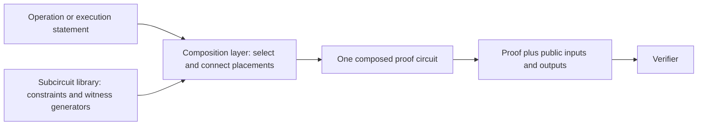

# Circuit Implementation and Composition Reference

## What this document explains

Tokamak zk-EVM proves that an Ethereum Virtual Machine (EVM) transaction was
executed correctly without asking the verifier to execute the transaction
again. The proof circuit is not written as one monolithic program. It is built
from smaller **subcircuits**, each of which handles a particular relation such
as addition, comparison, hashing, signature arithmetic, or movement across a
public input/output boundary.

This document explains the subcircuit library and the contracts needed to
compose it safely. It includes a versioned catalog for the circuit artifacts
introduced in `3.0.0` and reused in `3.0.1`. For each type, it answers five
questions:

1. What operation does it perform?
2. How many constraints did the recorded build contain?
3. How many input and output wires does it expose?
4. Which wires are public and which remain private?
5. Is the subcircuit sufficient by itself, or does it rely on a particular
   composition with other subcircuits?

The intended audience is any reader who needs to understand the circuit
library, including application developers, auditors, integrators, and new
contributors. The detailed tables remain useful to circuit maintainers, but
no prior knowledge of this repository is assumed.

## Where the subcircuits fit

The qap-compiler directory contains Circom source and tools for producing the
prebuilt subcircuit library. The directory name is historical; users receive
the artifacts through the `@tokamak-zk-evm/subcircuit-library` package. A
separate **composition layer** selects the required subcircuits and records how
their wires must be connected. The proving system then uses those placements
and connections as one composed circuit. A verifier sees only the final proof
and the wires that the composed interface declares public.



This distinction matters for security. A compiled subcircuit is a reusable
module, not normally a complete proof statement. Some modules are deliberately
split to stay small. For example, EVM division is implemented by `ALU4A`
followed by `ALU4B`; neither half proves division by itself. The final
permutation must connect the exact outputs of the first half to the exact
inputs of the second half.

Most users should therefore consume the synchronized package through a
supported composition layer, CLI, or proving backend. They should not select
individual R1CS files and treat them as standalone proofs.

## Terms used in this document

| Term | Meaning here |
| --- | --- |
| EVM word | One 256-bit bit pattern used by the EVM. Signed opcodes interpret the same pattern using two's-complement notation. |
| Limb | Half of an EVM word. This library represents one 256-bit word as two 128-bit limbs. |
| Wire | One scalar-field value entering, leaving, or connecting circuit constraints. A 256-bit word therefore occupies two physical wires. |
| Constraint | An algebraic equation that a valid witness must satisfy. More constraints generally mean more proving work, but the count is not a security score. |
| R1CS | Rank-1 constraint system, the compiled algebraic form consumed by setup and proving. |
| Witness | The complete set of public and private wire values used to satisfy the circuit. |
| Public wire | A value bound to the final proof statement and available to the verifier. |
| Private wire | A witness value hidden from the verifier. Private does not mean unconstrained. |
| Placement | One use of a subcircuit in the circuit generated for a transaction. |
| Permutation | The final wire connections that make one placement's output equal another placement's input. |
| Canonical representation | The unique allowed limb encoding of an integer or field element. |
| Soundness | The property that satisfying the constraints is enough to establish the operation claimed by the circuit contract. |

### Logical types and physical wires

Non-buffer interfaces use a closed set of logical types. The interface JSON
files under `subcircuits/interface/` declare these types, and the build parser
derives the physical wire count rather than accepting a separately selectable
wire layout:

| Logical type | Meaning | Physical representation |
| --- | --- | --- |
| `uint(bits)` for `1 <= bits <= 160` | An unsigned integer in the declared range | One field wire |
| `uint(bits)` for `161 <= bits <= 256` | An unsigned integer in the declared range | Two lower-first limb wires: 128 low bits, then `bits - 128` high bits |
| `bls12-381-fr` | One native BLS12-381 scalar-field element | One field wire |
| `jubjub-scalar` | One integer in the Jubjub scalar domain | One field wire |

Buffers are deliberately different. They are generic arrays of field wires
and have no per-entry interface JSON. A buffer may carry native field values,
one-wire flags or narrow integers, and limb pairs in the same physical array.
The connected producer, consumer, and public-boundary protocol retain the
logical meaning of each wire; the buffer itself proves only equality.

The generated witness wrapper uses the logical interface metadata to warn when
an original input is outside its declared domain. A warning is diagnostic only:
it is not a circuit constraint, does not make an invalid witness valid, and
must not be treated as a security check. Soundness comes from circuit
constraints and the explicitly documented composition and verifier contracts.

## How to interpret the soundness status

The status describes the current source-level relation under the composition
model used by Tokamak zk-EVM:

- **Locally sound** means the subcircuit itself enforces the listed operation
  for its declared input representation. It still needs normal wire routing,
  but it has no mandatory partner circuit.
- **Composition-dependent** means the system claim is sound only when the
  composition layer and final permutation enforce the exact producer, consumer,
  ordering, or public-boundary contract stated in this document.
- **Incomplete** means known constraint work remains in the current source.
  The normal composition topology alone is not enough to claim soundness for
  that operation.

An `Incomplete` row is a warning about the repository state described by this
page, not a conclusion about every previously published npm release. A release
must be evaluated using the source, generated artifacts, and setup material
from that same version. Never mix artifacts from different versions.

This page is an engineering reference, not a formal proof or third-party
security certification. It reports composition dependencies explicitly so
that a property enforced by another subcircuit or by the verifier boundary is
not mistakenly attributed to an isolated artifact.

## Three representative examples

### A self-contained arithmetic operation

For `ADD`, the composition layer places the selector-free `ADD` subcircuit with
two EVM words. `ADD` constrains the truncated EVM addition and canonicalizes
its result. When an operand originates directly from a buffer, the composition
also places the required `CheckBus256` before `ADD`; no selector wire or merged
arithmetic wrapper is involved.

### An operation split across two subcircuits

For `DIV`, the composition layer must place `ALU4A` and `ALU4B` in that order.
`ALU4A` prepares the quotient, remainder, magnitude, and mode information;
`ALU4B` checks the remaining division relation and produces the EVM result.
The pair is sound only if all 13 intermediate wires are connected exactly, so
both rows are marked composition-dependent.

### A public boundary

`bufferTxIn` copies public transaction-input wires to private internal wires.
The verifier can see the public side, while later computation uses the private
side. `bufferPrvIn` is different: both sides remain private because it carries
private witness data. Buffer constraints prove equality across the boundary;
the surrounding protocol assigns meaning to the values.

## How the rest of this page is organized

- **Buffer subcircuits** lists the modules that cross the final public/private
  boundary and explains the type and capacity of each buffer.
- **Computational subcircuits** lists arithmetic, comparison, hashing,
  signature, conversion, and equality modules.
- **Mandatory and conditional composition contracts** expands every table row
  whose security or full operation semantics depend on another placement or
  on a restricted producer.
- **Update checklist** tells maintainers which synchronized artifacts and
  contracts must be reconsidered when the implementation changes.
- **Build-specific composition record** preserves partition choices and
  composition measurements for the catalog snapshot, separately from the
  operation-level proof obligations.

## Catalog scope and build snapshot

The tables cover every production target in
[`scripts/compile.sh`](../../scripts/compile.sh) at the recorded snapshot. The
`3.0.1` library reuses the circuit artifacts introduced in `3.0.0`. The catalog
was measured from source snapshot
`6991047705d46d2218fd56d957e051248217802b` (2026-09-23) with Circom
`2.2.3`, explicit O2 optimization, and the BLS12-381 scalar field. These tables
record that build's types, capacities, physical interfaces, and measured costs;
they are not a promise that every later build has the same counts. For an
installed library, use its generated metadata and matching composition
definitions to resolve the artifact layout.

The snapshot contains 44 compiled subcircuit types: seven
generic buffers, 30 general computational or support types, and seven
transaction-signature component types. This is a physical library catalog,
not a count of EVM operations or transaction placements. A logical operation
may select one type, compose several different types, or place the same type
multiple times.

The recorded O2 build has the following catalog totals. These values sum
each distinct compiled type exactly once; they are not a transaction's dynamic
placement count or its placement-weighted proving cost. “Internal wires”
excludes each wrapper's constant-one wire and declared input/output ports.

| Catalog subset | Types | Constraints | R1CS wires | Internal wires | Input ports | Output ports | Nonzero coefficients |
| --- | ---: | ---: | ---: | ---: | ---: | ---: | ---: |
| Entire production catalog | 44 | 23,667 | 23,762 | 22,659 | 570 | 489 | 145,605 |
| Generic buffers | 7 | 696 | 703 | 0 | 348 | 348 | 2,088 |
| Computational and support types | 30 | 17,588 | 17,632 | 17,329 | 169 | 104 | 108,449 |
| Transaction-signature types only | 7 | 5,383 | 5,427 | 5,330 | 53 | 37 | 35,068 |

A hypothetical “one placement of every type” would contain 44 placements, but
it is not an operation supported by the system. Actual placement multiplicity
depends on the operation and its composition. For example, most ALU opcodes
use one placement, while division uses the `ALU4A -> ALU4B` pair. The
[build-specific composition record](#build-specific-composition-record)
identifies the measured signature and exponentiation topologies.

> **Evidence and qualification boundary**
>
> Circuit-local tests and Synthesizer routing tests provide evidence for the
> relations and connections described here. They do not establish that a
> deployed Solidity verifier enforces every public-boundary check; that
> requires separate integration verification. The generated library is a
> build-time output and is intentionally not checked in. Release qualification
> requires matching circuit artifacts and CRS source identity; this page is
> not a record of a particular deployment's qualification.

A constraint total is the sum of the compiler's reported nonlinear and linear
constraints. Counts can change with compiler settings or equivalent constraint
optimizations without changing the proved relation. Such changes do not make
this dated measurement inaccurate. A new measurement must identify its own
source and toolchain rather than silently replacing part of this snapshot.

O2 may eliminate a private signal that is used only through linear relations.
Every compiled subcircuit wrapper therefore exposes its intended physical
inputs as temporary public inputs to Circom. The final composition layer still
assigns actual proof visibility; this standalone compiler annotation exists
only to preserve every reviewed subcircuit interface wire during O2.

Wire counts are physical scalar-field wires. Interface counts do not include
the local constant-one wire. Every 256-bit word uses this order:

1. lower 128-bit limb
2. upper 128-bit limb

Visibility refers to the final composed proof interface constructed by
[`scripts/parse.js`](../../scripts/parse.js) and
[`scripts/configure.js`](../../scripts/configure.js), not to the temporary
standalone visibility used while Circom compiles one wrapper. All non-buffer
interfaces are private internal wires. The public side of each buffer is
selected explicitly by `LIBRARY_LAYOUT.publicWireSegments`.

Physical non-buffer privacy must not be confused with semantic disclosure.
For transaction-signature verification, `contract`, `selector`, `S`, the signed
channel transaction index, and the identity point `O` are bound through public
buffers even though their wires are routed privately after crossing that
boundary. The index is a native field value supplied through `bufferTxIn` and
included in the signature challenge; it binds the signature to the public
transaction identity. `A`, `R`, private transaction inputs, the challenge hash,
the public-key hash, and all signature accumulator state remain hidden. A
composition is valid only if it connects these exact boundary-supplied wires;
substituting an equal-looking host value is not an equivalent security contract.

## Buffer subcircuits

Every buffer is a `Buffer2` equality boundary: it constrains each output wire
to equal the corresponding input wire and adds a nonlinear constraint to keep
both columns represented in the R1CS. That copy relation is locally sound.
The semantic type, capacity, padding interpretation, and public-format checks
are composition or higher-protocol responsibilities.

A buffer capacity is the number of physical input wires accepted by its
`Buffer2` instance. The buffer exposes the same number of output wires, but
those outputs are not added to the capacity. Buffers do not impose one common
logical value type: a native field value or one-limb value occupies one input
wire, while a 256-bit EVM word occupies two 128-bit-limb input wires. Mixed
values therefore consume capacity according to their actual physical wire
layouts after expansion by the composition layer.

| Subcircuit | Role and snapshot capacity | Snapshot constraints (nonlinear + linear = total) | Final interface visibility | Soundness contract |
| --- | --- | ---: | --- | --- |
| `bufferLogOut` | Committed EVM log output; 50 input wires | 50 + 50 = 100 | 50 private inputs -> 50 public outputs | Local equality; the higher protocol interprets tuple layout and all-zero padding. |
| `bufferStorageStore` | Final storage writes; 30 input wires | 30 + 30 = 60 | 30 private inputs -> 30 public outputs | Local equality; triples must be routed as address, key, value. |
| `bufferStorageLoad` | Initial storage reads; 50 input wires | 50 + 50 = 100 | 50 private inputs -> 50 public outputs | Local equality; triples must be routed as address, key, value. |
| `bufferTxIn` | Public signature response, target contract, function selector, and signed channel transaction index; 4 input wires | 4 + 4 = 8 | 4 public inputs -> 4 private outputs | Local equality plus public-boundary format checking; the exact index wire feeds the signature challenge. |
| `bufferBlockIn` | Block fields and previous block hashes; 24 input wires | 24 + 24 = 48 | 24 public inputs -> 24 private outputs | Local equality plus public-boundary format checking. |
| `bufferEVMIn` | Fixed EVM inputs and constants; 140 input wires | 140 + 140 = 280 | 140 public inputs -> 140 private outputs | Local equality plus public-boundary format checking. |
| `bufferPrvIn` | Private witness inputs; 50 input wires | 50 + 50 = 100 | 50 private inputs -> 50 private outputs | Local equality; it is intentionally absent from `LIBRARY_LAYOUT.publicWireSegments`. |

Public-output buffers are fixed-capacity and zero-padded. The higher-level
protocol filters storage entries with a zero address and log entries whose
fields are all zero. The buffer circuits do not perform those semantic checks.

## Computational subcircuits

In the interface descriptions below, `word` means two physical 128-bit limb
wires and `bit` means one scalar-field wire constrained to be boolean where the
stated local relation requires it. All interfaces in this table are private
inside the final composed proof; the verifier does not receive each arithmetic
input and intermediate result as a separate public value.

| Subcircuit | Operation or role | Snapshot constraints (nonlinear + linear = total) | Private interface | Status |
| --- | --- | ---: | --- | --- |
| `ADD` | EVM `ADD` | 258 + 0 = 258 | 4 inputs: two words; 2 outputs: one word | Composition-dependent for operand canonicality. It constrains truncated addition and a canonical result; direct buffer operands require preceding `CheckBus256` placements. |
| `MUL` | EVM `MUL` | 909 + 0 = 909 | 4 inputs: two words; 2 outputs: one word | Locally sound. It decomposes both operands into canonical limbs, constrains truncated multiplication, and canonicalizes the result. |
| `SUB` | EVM `SUB` | 258 + 0 = 258 | 4 inputs: two words; 2 outputs: one word | Composition-dependent for operand canonicality. It constrains truncated subtraction and a canonical result; direct buffer operands require preceding `CheckBus256` placements. |
| `NOT` | EVM `NOT` | 256 + 2 = 258 | 2 inputs: one word; 2 outputs: one word | Locally sound. The complement relation and canonical output constrain each input limb to its 128-bit range. |
| `EQ` | EVM `EQ` | 5 + 1 = 6 | 4 inputs: two words; 2 outputs: a boolean word | Locally sound for exact physical-limb equality. The relation does not interpret operands as canonical EVM integers, so it needs no canonicality guard. |
| `ISZERO` | EVM `ISZERO` | 5 + 1 = 6 | 2 inputs: one word; 2 outputs: a boolean word | Locally sound for exact physical-limb zero. The relation does not interpret its operand as a canonical EVM integer, so it needs no canonicality guard. |
| `LT` | EVM unsigned `LT` | 261 + 1 = 262 | 4 inputs: two words; 2 outputs: a boolean word | Composition-dependent for operand canonicality. The comparisons constrain limb differences, not each input limb's range. Both operands must come from canonical producers or have `CheckBus256` guards when supplied directly by buffers. |
| `GT` | EVM unsigned `GT` | 261 + 1 = 262 | 4 inputs: two words; 2 outputs: a boolean word | Composition-dependent for operand canonicality. The comparisons constrain limb differences, not each input limb's range. Both operands must come from canonical producers or have `CheckBus256` guards when supplied directly by buffers. |
| `SLT` | EVM signed `SLT` | 519 + 1 = 520 | 4 inputs: two words; 2 outputs: a boolean word | Composition-dependent for operand canonicality. It range-constrains both upper limbs and combines unsigned ordering with their sign bits, but lower-limb bounds remain a composition requirement. Both operands must come from canonical producers or have `CheckBus256` guards when supplied directly by buffers. |
| `SGT` | EVM signed `SGT` | 519 + 1 = 520 | 4 inputs: two words; 2 outputs: a boolean word | Composition-dependent for operand canonicality. It range-constrains both upper limbs and combines unsigned ordering with their sign bits, but lower-limb bounds remain a composition requirement. Both operands must come from canonical producers or have `CheckBus256` guards when supplied directly by buffers. |
| `AND` | EVM `AND` | 768 + 0 = 768 | 4 inputs: two words; 2 outputs: one word | Locally sound. It bit-decomposes both operands and reconstructs the canonical bitwise result. |
| `OR` | EVM `OR` | 768 + 0 = 768 | 4 inputs: two words; 2 outputs: one word | Locally sound. It bit-decomposes both operands and reconstructs the canonical bitwise result. |
| `XOR` | EVM `XOR` | 768 + 0 = 768 | 4 inputs: two words; 2 outputs: one word | Locally sound. It bit-decomposes both operands and reconstructs the canonical bitwise result. |
| `SHR` | EVM logical `SHR` | 795 + 0 = 795 | 4 inputs: shift word, value word; 2 outputs: one word | Composition-dependent for shift canonicality. The low shift limb and both value limbs are canonical locally; the high shift limb is checked only for zero because every nonzero value yields the same zero result. A canonical producer or a `CheckBus256` guard on a direct buffer-origin shift must establish the high limb's 128-bit range. |
| `ALU3` | `BYTE`, `SIGNEXTEND`, and `SAR` | 862 + 0 = 862 | 5 inputs: selector, index-or-shift word, value word; 2 outputs: one word | Composition-dependent for the first word only. It constrains eight low index/shift bits and classifies all remaining bits through zero relations, while fully decomposing the value word for each operation. A direct buffer-origin first word requires the declared preceding `CheckBus256`; a canonical producer output does not. Its cubic selector relation admits exactly the three supported selectors. |
| `ALU4A` | First half of `DIV`, `MOD`, `SDIV`, `SMOD` | 672 + 0 = 672 | 5 inputs: selector, dividend word, divisor word; 13 outputs | Composition-dependent; never use as an independent EVM operation. It constrains the selector to exactly the four supported operations and must be followed by `ALU4B` with all 13 outputs connected exactly. |
| `ALU4B` | Second half of `DIV`, `MOD`, `SDIV`, `SMOD` | 802 + 0 = 802 | 13 inputs; 2 outputs: one word | Composition-dependent; never use independently. Its inputs must be the exact `ALU4A` outputs from the same operation. |
| `SHL` | Full-domain EVM logical left shift | 795 + 0 = 795 | 4 inputs: shift word, value word; 2 outputs: one word | Composition-dependent for exact limb representation. The low shift limb and both value limbs are canonical locally; the high shift limb is checked only for zero because every nonzero value yields the same zero result. Its producer must constrain that wire as a canonical 128-bit limb. |
| `ADDMODPrepare` | Canonicalizes the addends and prepares the exact 257-bit numerator and bounded reduction candidates | 943 + 1 = 944 | 6 inputs: three words; 8 outputs: three numerator words, three quotient words, and one remainder word | Composition-dependent. It decomposes both addends into field-safe radix-86 words, proves their exact sum, bounds the complete quotient candidate, and emits the remainder candidate. The remainder becomes constrained only in `ADDMODVerify`. |
| `ADDMODVerify` | Canonicalizes the modulus and remainder, verifies the 257-by-256 reduction, and returns the EVM result | 957 + 2 = 959 | 10 inputs: eight preparation wires plus the original modulus word; 2 outputs: one word | Composition-dependent. It must receive the exact `ADDMODPrepare` outputs and the exact original modulus operand. It proves `numerator = quotient * safeModulus + remainder` in radix 86, enforces `remainder < safeModulus`, and returns zero for an original zero modulus. |
| `MULMODPrepare` | Canonicalizes the three EVM operands and generates the full-width quotient and remainder candidates | 768 + 6 = 774 | 6 inputs: three words; 18 outputs: twelve 64-bit operand words, four quotient limbs, and two remainder limbs | Composition-dependent; never use independently. The operand words are canonical, but the quotient and remainder outputs are witness candidates whose validity is established only by the following two stages. |
| `MULMODCandidate` | Canonicalizes the quotient and remainder candidates for the full-width reduction relation | 768 + 6 = 774 | 6 inputs: four quotient limbs and two remainder limbs; 12 outputs: eight quotient words and four remainder words | Composition-dependent; never use independently. Its six inputs must be the exact candidate outputs of `MULMODPrepare`, without host reconstruction or substitution. |
| `MULMODVerify` | Proves the complete 512-bit multiplication and modular-reduction relation and returns the EVM result | 981 + 2 = 983 | 24 inputs: twelve operand words, eight quotient words, and four remainder words; 2 outputs: one word | Composition-dependent; never use independently. It proves `lhs * rhs = quotient * safeModulus + remainder`, enforces `remainder < safeModulus`, and uses a safe modulus of one so zero modulus returns zero. |
| `AssertZeroWord` | Requires a two-limb word to be exactly zero | 0 + 2 = 2 | 2 inputs: one word; no outputs | Locally sound as a zero check. In EVM `EXP`, it must consume the exact final exponent remainder; it is not an exponentiation proof by itself. |
| `SubExp` | One LSB-first square-and-multiply step for EVM `EXP`, including the exponent-remainder transition | 796 + 0 = 796 | 6 inputs: accumulator, base power, and exponent remainder as three words; 6 outputs: the next three state words | Composition-dependent; never use independently. It canonicalizes accumulator and base-power inputs, derives the current exponent bit, constrains the remainder shift, and constrains truncated square and multiplication modulo `2^256`. The initial exponent must be canonical, and all six state wires must feed the exact next step. The final remainder must feed `AssertZeroWord`, and the final accumulator must feed `CheckBus256`. The unused final base power is discarded. |
| `CheckBus256` | Canonicalizes one 256-bit word | 256 constraints | 2 inputs: one word; no outputs | Locally sound. It is a constraint-only consumer: direct buffer operands feed it and their consuming operation in parallel. In the EVM `EXP` composition it is the mandatory terminal consumer of the final `SubExp` accumulator, while that accumulator remains the operation result. |
| `MemoryViewStep` | Applies one byte-aligned fragment to a running 256-bit memory view and its packed byte-ownership state | 614 + 1 = 615 | 7 inputs: source word, encoded byte shift, incoming ownership, previous word, and previous ownership; 3 outputs: next word and ownership | Composition-dependent; never use independently. Source limbs, the six-bit encoded shift, ownership masks, byte shifting, masking, and disjointness are constrained locally. The first placement must receive an exact zero state, and every later placement must receive the previous placement's exact three outputs. |
| `Poseidon` | Selector-chosen chain of up to four two-input Poseidon compressions over `uint(256)` words in this snapshot | 964 + 0 = 964 | 11 inputs: selector and five lower-first `uint(256)` words; 2 outputs: one lower-first `uint(256)` word | Composition-dependent for exact limb representation. The local hash relation is `PoseidonFr(x mod Fr)` for each input word and intentionally does not require `x < Fr`; connected producers or the public-boundary verifier must constrain each physical limb to its declared width. |
| `FrToLimbsPair` | Converts two independent native BLS12-381 scalar-field values to lower-first two-limb EVM words | 1,022 + 2 = 1,024 | 2 native-field inputs; 4 outputs: two lower-first limb pairs | Locally sound as two canonical conversions. Each input is constrained to its unique integer representation `0 ≤ x < Fr`; the circuit is general-purpose and is not part of the TSV placement catalog. |
| `TransactionSignaturePoseidonBatch4` | Performs either four consecutive native-field Poseidon compressions or one independent compression plus a three-compression chain | 950 + 0 = 950 | 7 inputs: mode and six native field wires; 2 native-field outputs | Composition-dependent. Mode is locally Boolean, but the composition must assign the approved structural mode and connect every chain state exactly. |
| `TransactionSignaturePointPolicy` | Checks contract width, validates `A` and `R`, applies the public-key cofactor policy, rejects an identity randomizer, builds the variable-base table, and computes `R8` | 223 + 5 = 228 | 8 inputs; 16 outputs: two selector limbs, two lower-first contract-word limbs, 8 table coordinates, and 4 `R8` coordinates | Composition-dependent. Solidity must bind selector width and the identity point; later signature placements must consume the exact table and `R8` outputs. The selector and contract word are derived from the constrained public inputs. |
| `TransactionSignatureFixedPrefix70` | Canonically decomposes `S` into 252 bits and processes fixed-base windows 0–69 | 1,016 + 0 = 1,016 | 1 native scalar input; 5 outputs: one packed 42-bit response tail and 4 accumulator coordinates | Composition-dependent. Solidity must bind `S < n`, and `TransactionSignatureFinal` must consume the exact packed tail and accumulator. |
| `TransactionSignatureChallengeChunks` | Canonically decomposes the native challenge hash and packs it into the first 63-bit chunk plus three 64-bit chunks | 511 + 1 = 512 | 1 native-field input; 4 packed integer outputs | Composition-dependent. It must consume the exact final challenge hash; the first variable batch must consume chunk 0, and the three later batches must consume chunks 1–3 in order. |
| `TransactionSignatureVariableFirstBatch32` | Processes the padded first 32 two-bit variable-base windows and creates the initial extended accumulator | 969 + 0 = 969 | 9 inputs: the first packed challenge chunk and 8 table coordinates; 4 extended-coordinate outputs | Composition-dependent. It must consume the exact first challenge chunk and point-policy table. |
| `TransactionSignatureVariableBatch32` | Processes one following 32-window packed challenge chunk | 992 + 0 = 992 | 13 inputs: one packed chunk, 8 table coordinates, and 4 prior accumulator coordinates; 4 extended-coordinate outputs | Composition-dependent. Exactly three serial placements consume chunks 1–3, the same exact runtime-table wires, and the preceding accumulator. |
| `TransactionSignatureFinal` | Processes fixed-base windows 70–83, enforces the cofactored signature equation, canonically decomposes the public-key hash, and returns the origin as a two-limb `uint256` EVM word | 716 + 0 = 716 | 14 inputs: packed response tail, fixed accumulator, final variable accumulator, `R8`, and native public-key hash; 2 outputs: origin limbs | Composition-dependent. It must receive the exact packed response tail, both final accumulator chains, exact `R8`, and native public-key hash. The circuit's origin relation remains narrower than the consumer type (`origin < 2^160`). |
| `StorageAccess` | Binds a repeated storage address/key pair to its canonical cached identity | 8 + 0 = 8 | Current 256-bit address, current 256-bit key, canonical 256-bit address, and canonical 256-bit key; no outputs | Locally sound as address and key equality. Storage consistency additionally depends on the composition layer routing the current and cached values to the corresponding positions. |

## Mandatory and conditional composition contracts

The proof obligations below explain why each composition is sound. Named
stages and physical port layouts refer to the catalog artifacts above: they
must be followed exactly when those artifacts are used. Their partition sizes
are implementation choices, not requirements that every future realization of
the same operation must preserve.

### Division family: `ALU4A -> ALU4B`

Every `DIV`, `MOD`, `SDIV`, and `SMOD` operation uses exactly two adjacent
placements in this order. `ALU4A` consumes the operation selector and original
operands. Its 13 physical outputs must be connected to the 13 `ALU4B` inputs
without substitution or reordering:

1. `absDividend[2]`
2. `absQuotient[2]`
3. `absRemainder[2]`
4. `absDivisorWords[4]`
5. `divisorIsZero`
6. `resultIsNegative`
7. `useMod`

Only the two-limb output of `ALU4B` is the EVM result. Neither half represents
a sound or independently usable EVM division operation.

### Modular family

Every logical `ADDMOD` uses exactly two placements:

```text
ADDMODPrepare -> ADDMODVerify
```

All eight physical preparation outputs must feed their declared
`ADDMODVerify` inputs without host reconstruction, substitution, or
reordering. The exact original modulus operand supplied to `ADDMODPrepare`
must also feed the two dedicated modulus inputs of `ADDMODVerify`. Only the
final two `ADDMODVerify` outputs form the EVM result. Neither target is an
independently usable EVM operation.

Circom inspection intentionally reports the `ADDMODPrepare` modulus and
remainder-candidate hint path as locally unconstrained. The modulus is needed
there to generate the quotient and remainder witness candidates, while
`ADDMODVerify` owns the actual reduction claim. This is acceptable only when
the exact original modulus and all exact preparation outputs are connected to
the verifier stage as specified above. The preparation target alone makes no
modular-reduction claim.

Every logical `MULMOD` uses exactly three placements:

```text
MULMODPrepare -> MULMODCandidate -> MULMODVerify
```

The operation has no selector input and no preceding `CheckBus256` placement.
`MULMODPrepare` locally canonicalizes all three input words. Its six physical
quotient and remainder candidate wires must feed `MULMODCandidate` exactly.
The twelve canonical operand-word outputs of `MULMODPrepare`, followed by all
twelve outputs of `MULMODCandidate`, must feed `MULMODVerify` in their declared
order. This produces 30 exact producer-consumer wire connections across the
composition. Host reconstruction, substitution, reordering, omission, or
independent use of any stage violates the soundness contract. Only the final
two `MULMODVerify` outputs form the EVM result.

Circom inspection intentionally reports the quotient and remainder candidate
signals in `MULMODPrepare` as locally unconstrained. They are witness-generation
hints, not claims proved by that stage. This warning is acceptable only because
the mandatory composition connects those exact wires to `MULMODCandidate` and
then to `MULMODVerify`, which proves their canonical bounds and complete
arithmetic relation. Treating `MULMODPrepare` as a standalone circuit would be
unsound.

The arithmetic relations preserve the full 257-bit addition numerator or
512-bit multiplication numerator. Reduction uses a safe modulus of one for an
EVM zero modulus, proves the complete quotient-product-plus-remainder identity,
and constrains the remainder below the safe modulus. Both operations therefore
return zero for a zero modulus without truncating the numerator.

### EVM exponentiation: `SubExp*` with terminal zero and range checks

The catalog's EVM `EXP(base, exponent)` composition processes the full 256-bit
exponent through serial `SubExp` placements. Each
step consumes and produces three two-limb words: an accumulator, a base power,
and the remaining exponent. The first step receives `1`, `base`, and the full
canonical exponent. Each step derives its current least-significant exponent
bit and shifts the remainder internally; no `DecToBit` target or separately
supplied bit sequence is used.

Each later step must consume all six exact state outputs of its predecessor.
After the last step, `AssertZeroWord` requires the exact exponent remainder to
be zero, while `CheckBus256` requires the exact final accumulator to be a
canonical EVM word. Both are constraint-only consumers with no outputs; the
final accumulator itself remains the EVM result. The final base power is
discarded.

This topology is part of the soundness contract. The initial exponent must
come from a canonical producer or feed a preceding `CheckBus256` alongside the
first step. Every six-wire state transition must be connected without
substitution or reconstruction, and both terminal checks are mandatory. A
standalone `SubExp` is not an independently usable exponentiation statement.

The number of steps and their measured cost are recorded below. A different
partition must still process the entire exponent, preserve exact state
continuity, and enforce the initial-domain and terminal conditions; merely
connecting some `SubExp` placements is not sufficient.

### Poseidon chain expansion

The composition layer folds an ordered input list through consecutive
two-input Poseidon compressions. It groups those compressions into placements
using the library's batch capacity. Each later placement must consume the exact
previous hash output as its first chain value. The input order, active
compression count, and selector are structurally determined by the input
count, not by witness values. The
[composition definition](../../../synthesizer/core/src/subcircuit/special-builders/poseidonComposition.ts)
and matching library interface specify the batch layout; the snapshot's
selector encoding and padding are recorded below.

The repeated topology is required for the higher-arity hash operation. Unique
`uint(256)` limb representation remains a separate producer or public-boundary
contract. The operation deliberately maps each reconstructed input integer to
the circuit field before hashing: inputs that differ by a multiple of `Fr`
represent the same Poseidon field input. It does not hash the two limbs as two
independent Poseidon inputs and it does not reject an input merely because the
reconstructed 256-bit integer is greater than or equal to `Fr`.

### Transaction-signature composition

Transaction signature verification is one operation split across hash, point
policy, scalar-multiplication, and terminal-check stages. These components are
not independent signature schemes. The complete composition must enforce all
of the following:

1. Bind every signed transaction value, including the public transaction
   index, into the prescribed ordered challenge hash. Compute the public-key
   hash from the exact authenticated key coordinates. These hashes use native
   field inputs, not the split-limb EVM `Poseidon` adapter.
2. Validate the signer and randomizer points, apply the public-key cofactor
   policy, reject an identity randomizer, and enforce the contract's 160-bit
   width. Derive the variable-base table and cofactored randomizer `R8` from
   those exact points.
3. Decompose the response scalar and challenge hash canonically, covering every
   bit required by the scalar-multiplication relation. Each multiplication
   stage must consume the exact preceding accumulator and the corresponding
   scalar segment in order. All variable-base stages must use the exact
   point-policy table.
4. Bind the remaining response segment, both final accumulator chains, `R8`,
   and the public-key hash into the terminal check. Enforce the cofactored
   signature equation and derive the origin from a canonical hash view. The
   output is a lower-first two-limb EVM word, with `origin < 2^160`.

The
[composition definition](../../../synthesizer/core/src/subcircuit/special-builders/txSignVerifyComposition.ts)
specifies the physical routing for the selected library configuration. The
snapshot's hash batches and scalar windows are listed in the build-specific
record, not treated as universal signature-protocol requirements. The
[direct-composition regression test](../../subcircuits/test/test_transaction_signature_production_composition.cjs)
checks circuit-local acceptance and rejection and compares contract, selector,
and origin outputs for accepted cases. The
[compatibility replay](../../subcircuits/test/test_transaction_signature_tokamak_l2js_compatibility.cjs)
checks agreement with `tokamak-l2js@0.2.0`. Cases that require delegated public
checks remain verifier-boundary obligations, not expected local circuit
rejections.

The circuit owns contract width, point validity, public-key cofactor policy,
randomizer identity rejection, canonical challenge and public-key-hash views,
scalar arithmetic, the cofactored terminal equation, and origin derivation.
Transaction inputs remain native field wires during signature verification.
When later EVM execution needs 256-bit words, the composition layer must place
general `FrToLimbsPair` conversions on those exact authenticated input wires
and must route only the conversion outputs into the EVM path; those conversions
are outside the signature-verification composition. The Solidity verifier
must bind the exact public wires and enforce
`S < n`, `selector < 2^32`, and `O = (0, 1)`. These delegated checks are part of
the complete statement and cannot be omitted. Signer points, private transaction
inputs, hash values, and intermediate accumulator coordinates remain private
internal wires.

The diagnostic direct composition has its own test-wrapper visibility. It
does not reproduce the final proof's public-buffer layout. In particular, its
channel transaction index is private, whereas in the Synthesizer it
comes from the public `bufferTxIn` boundary and feeds the exact signature
challenge wire. The
[public-route tests](../../../synthesizer/node-cli/tests/unit/channel-transaction-index-public-route.test.ts)
check that connection and its public-instance projection. Diagnostic wrapper
counts must not be treated as the visibility or public indices of the final
composed proof.

### Memory-view composition

Two memory-view cases need no `MemoryViewStep` placement. A completely
uninitialized view uses the exact static-zero route. A view consisting of one
fragment that owns all 32 bytes and needs no shift reuses the exact source-word
wires. For this reuse, the zero shift and full ownership mask must be
topology-fixed constants, and the result must retain the source wire identity.

All other memory views place one `MemoryViewStep` for every source fragment.
The first placement receives the exact state `[wordLow = 0,
wordHigh = 0, ownership = 0]`. Each later placement receives the preceding
placement's two word limbs and packed ownership output without substitution or
reordering. The final two word outputs form the reconstructed EVM word; the
ownership output is composition state and is not an EVM result.

Each placement receives the original, unshifted source word; a six-bit encoded
shift whose low five bits are the byte-shift magnitude and whose high bit is the
direction (`0` left, `1` right); and one packed ownership bit for every target
byte supplied by that fragment. The circuit constrains the shift, masks unowned
bytes, rejects ownership overlap, and combines only disjoint byte positions
with the running word. Consequently
the serial composition needs neither an addition carry witness nor a terminal
word range-check placement.

Every placement returns the real ownership union. The composition layer must
bind all three state wires exactly and selects the last placement's word as the
reconstructed result. Any unowned byte remains zero by induction from the exact
zero initial state and the rule that a step writes only bytes it owns. There is
no separate expected-coverage input; coverage follows from the constrained
ownership masks and state transitions.

The composition layer must convert each selected memory byte from its existing
`FF`/`00` value mask to the same-position ownership bit and reject malformed
mask bytes and non-byte-aligned shifts. It must not add a synthetic zero-valued
fragment for uninitialized gaps. These producer,
ownership, and state-wiring conditions are mandatory soundness dependencies
and require Synthesizer permutation tests before the source catalog can be
enabled.

### Public boundary contract

A complete system and every releasable artifact set must validate the format
of every public buffer input and output in the verifier wrapper. Non-buffer
inputs and outputs remain private internal wires connected by the final
permutation. The current source catalog alone does not prove that a deployed
wrapper already satisfies this requirement. Current public buffers already
carry native-field values, including the signed channel transaction index, and
the Jubjub response scalar `S`. The verifier boundary must enforce each value's
declared domain, including the canonical native-field range and `S < n`, rather
than relying only on field normalization.
For the general `Poseidon` adapter, the boundary instead enforces the declared
`uint(256)` limb widths; `x < Fr` is intentionally not part of that operation.

## Update checklist

Update the semantic reference when a change affects the proved relation,
accepted input domains, public/private boundaries, or mandatory composition
contracts. A compiler change, equivalent constraint optimization, or addition
of regression cases does not by itself require rewriting those explanations.

For implementation changes, review the affected contracts and artifacts:

1. If targets or ports change, synchronize the production target list,
   consumer registries, interface JSON, and composition definitions. Verify
   that logical ports expand to the compiled physical wire layout.
2. If a topology or input domain changes, re-evaluate local soundness and exact
   producer/consumer routing, and update the corresponding permutation tests.
   Recheck initial state, terminal conditions, and public/private boundaries.
3. Preserve unambiguous physical expansion for every supported logical type;
   generic buffers must not acquire an implicit value type. Witness warnings
   remain diagnostic, not a substitute for constraints or verifier checks.
4. Rebuild and validate affected artifacts before use. Regenerate published
   artifacts and setup material as required by the reviewed change; this page
   does not replace artifact compatibility or release qualification.
5. When publishing a new catalog measurement, identify its source snapshot,
   compiler, field, and optimization settings, and refresh the derived tables
   and composition costs together. Do not present the existing dated counts
   as measurements of a later build.

## Build-specific composition record

This section records implementation partitions and costs for the source and
toolchain identified in [the catalog snapshot](#catalog-scope-and-build-snapshot).
The partition choices explain that build, not every possible implementation of
the same relations. They must nevertheless be respected when composing its
artifacts.

### Arithmetic placement costs

| Operation | Snapshot placements | Placement-weighted constraints |
| --- | --- | ---: |
| `ADDMOD` | One `ADDMODPrepare` and one `ADDMODVerify` | `944 + 959 = 1,903` |
| `MULMOD` | One each of `MULMODPrepare`, `MULMODCandidate`, and `MULMODVerify` | `774 + 774 + 983 = 2,531` |
| `EXP` | 256 serial `SubExp`, one `AssertZeroWord`, and one terminal `CheckBus256`: 258 placements | `256 * 796 + 2 + 256 = 204,034` |

Each distinct target stays within the 1,024-constraint limit. The three
distinct `EXP` types sum to 1,054 constraints, which is not the cost of their
repeated composition. If the initial exponent needs an additional
`CheckBus256`, it adds one placement and 256 constraints to the recorded core.

### Poseidon batch layout

The snapshot groups up to four two-input compressions into one `Poseidon`
placement. Selectors `1`, `2`, `4`, and `8` select one through four
compressions. Each placement receives five padded `uint(256)` words: the chain
value and four possible right-hand inputs. Longer lists repeat this layout
with exact hash-state continuity.

### Transaction-signature partition and measurements

For 29 private transaction inputs, the snapshot uses seven types in 17
placements:

| Type | Placements | Snapshot partition |
| --- | ---: | --- |
| `TransactionSignaturePoseidonBatch4` | 9 | Eight chain-mode batches compute challenge hashes 0–31; one independent-mode batch computes the public-key hash and challenge hashes 32–34. |
| `TransactionSignaturePointPolicy` | 1 | Produces the selector and contract views, runtime table, and `R8`. |
| `TransactionSignatureFixedPrefix70` | 1 | Processes response bits 0–209 in fixed-base windows 0–69; emits the packed 42-bit tail (bits 210–251) and accumulator. |
| `TransactionSignatureChallengeChunks` | 1 | Emits the canonical challenge as one leading 63-bit chunk and three 64-bit chunks. |
| `TransactionSignatureVariableFirstBatch32` | 1 | Processes the padded first 32 two-bit windows using chunk 0 and creates the accumulator. |
| `TransactionSignatureVariableBatch32` | 3 | Serial batches process chunks 1–3 using the same runtime table and exact preceding accumulator. |
| `TransactionSignatureFinal` | 1 | Processes fixed-base windows 70–83, consumes both final accumulator chains, `R8`, and the public-key hash, and checks the signature equation and origin. |

These hash placements cover 35 challenge compressions and one public-key
compression. The seven distinct types contain 5,383 constraints and 5,427 R1CS
wires. The 17 placements contain 14,967 constraints before final cross-placement
permutation, with 135 physical input ports and 61 physical output ports counted
across placements. General `FrToLimbsPair` conversions for subsequent EVM use
are not included.

The snapshot's diagnostic direct composition compiled to 14,943 nonlinear plus
3 linear constraints, 14,969 R1CS wires, and 135,511 nonzero coefficients. These
are measurements of a standalone test wrapper, not the cost or visibility of
the final composed transaction proof.
